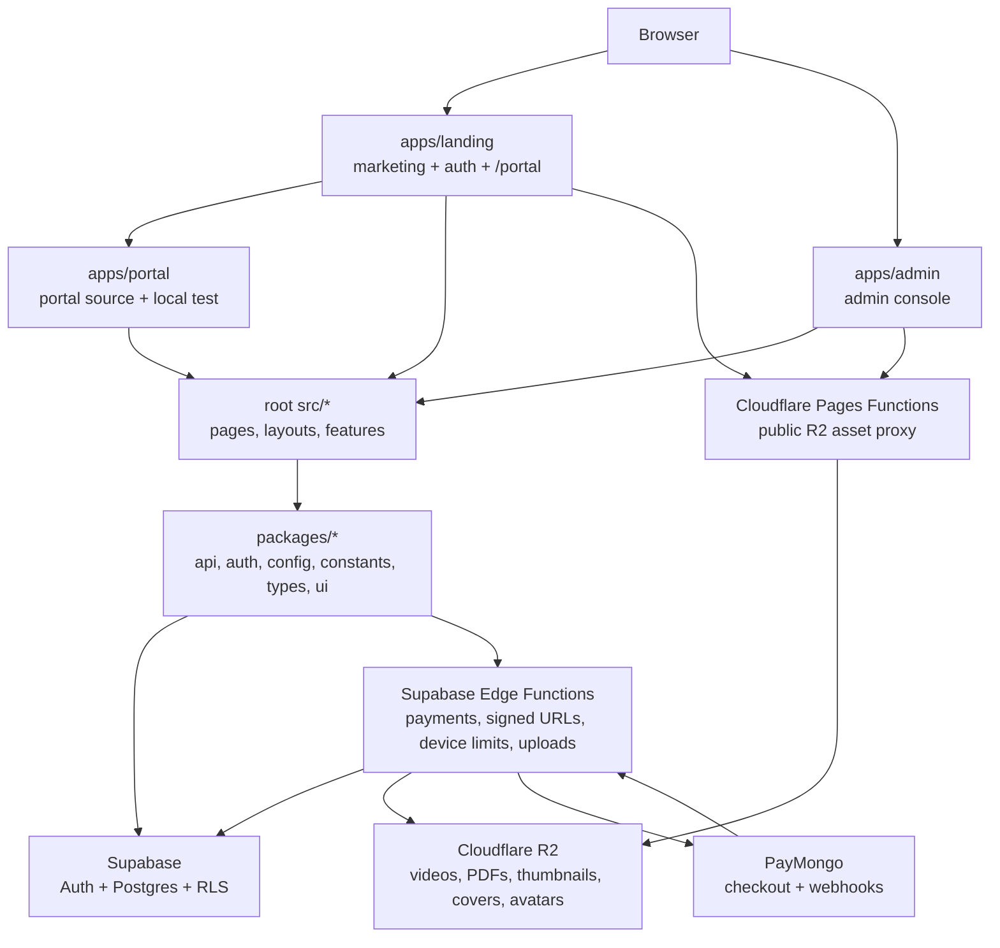

# Architecture Overview

Last reviewed: 2026-06-18

## Purpose

This repository implements a subscription-based eLearning review platform. It serves:

- a public marketing and preview site,
- an authenticated student portal,
- an admin console for content and operations,
- Supabase-backed auth, data, edge functions, and payment workflows,
- Cloudflare R2-backed media storage.

The codebase is in the middle of a monorepo/app-shell split. The active direction is `apps/*` plus shared `packages/*`, while much of the feature UI still lives in the root `src/*` tree and is reused through Vite aliases. Landing and the student portal now share one browser origin; admin remains separate. Production deploys the Landing/Website and Admin apps; `apps/portal` remains as source and an isolated local test workspace.

## High-Level Shape



## Runtime Applications

| App | Path | Dev port | Responsibility |
| --- | --- | --- | --- |
| Landing | `apps/landing` | `5174` | Public marketing pages, public book browsing, pricing, `/preview/*`, shared auth routes, and the same-origin `/portal/*` student portal. |
| Portal | `apps/portal` | `5175` | Source workspace for student portal pages/components and isolated local testing. It is not a production Cloudflare Pages deployment; normal production student access is served by `apps/landing` under `/portal`. |
| Admin | `apps/admin` | `5176` | Same-origin admin login and guarded `/admin/*` content operations. Non-admin users are bounced to portal. |
| Legacy root app | `src/app/router.tsx` | `5173` | Historical single-SPA router. Still buildable and useful for compatibility, but comments indicate active runtime routing now lives in the per-app routers. |

The three Vite workspaces point `@/*` at the root `src/*` directory. This lets the split apps reuse the existing page and feature implementation while the repository is gradually moved into packages.

## Package Boundaries

| Package | Role |
| --- | --- |
| `@s-class/api` | Browser-safe data/service layer. Owns Supabase client, REST client, token service, storage helpers, provider-routed domain APIs, and mock data. |
| `@s-class/auth` | Zustand auth store, saved subject store, quiz history store, auth hooks, and shared route guards. |
| `@s-class/config` | Central runtime config from `import.meta.env`. Component and service code should import config here instead of reading env vars directly. |
| `@s-class/constants` | Route constants and cross-origin URL helpers. Owns route ownership decisions for landing/portal and admin. |
| `@s-class/types` | Shared domain TypeScript types for auth, courses, subjects, lessons, quiz, books, subscription, devices, and home content. |
| `@s-class/ui` | Shared primitive UI components and `cn()` utility. |

The packages are source-only workspace packages. They are consumed directly by Vite/TypeScript rather than built into separate distributable artifacts.

## Frontend Layering

The common request path is:

```text
app router -> layout/route guard -> page -> feature component/hook -> domain API -> provider -> Supabase/REST/mock
```

Important frontend directories:

- `apps/*/src/app/router.tsx`: per-app route ownership.
- `apps/*/src/components`: app-specific route guards and redirect helpers.
- `src/pages`: route-level screens reused by the split apps.
- `src/layouts`: public root shell, portal shell, admin shell, navbar, navigation definitions.
- `src/features/*`: feature-owned components, hooks, services, local data, and types.
- `src/components` and `src/components/ui`: shared app-level components and legacy UI primitives.
- `src/services` and `src/store`: compatibility shims plus older service/store locations. Several now re-export package implementations.

## Service and Provider Model

The data access pattern is provider-routed:

```text
domainApi.ts
  if VITE_USE_MOCK=true -> local mock data
  else if VITE_AUTH_PROVIDER=supabase -> Supabase service implementation
  else -> REST apiClient
```

Examples:

- `packages/api/src/authApi.ts`
- `packages/api/src/lessonApi.ts`
- `packages/api/src/subjectApi.ts`
- `packages/api/src/quizApi.ts`
- `packages/api/src/booksApi.ts`

Components and hooks should depend on the domain API facade, not on provider-specific files, unless the surrounding code already owns that exception. This keeps mock, REST, and Supabase backends swappable at the boundary.

## State Management

State is primarily handled with Zustand:

- `useAuthStore` in `@s-class/auth/authStore`
  - tracks user, auth status, admin flag, subscription snapshot, initialization state, confirmation state, and pending device-limit state.
  - calls `initialize()` at app startup before the router renders to avoid protected-route redirect flashes.
  - synchronizes subscription state from Supabase after login, registration, and session restore.
  - registers/touches the current device via an Edge Function.
- `useSavedSubjectsStore`
  - stores saved subject IDs, dashboard stats, and per-subject progress.
  - uses optimistic updates with rollback/re-fetch on failure.
- `useQuizHistoryStore`
  - stores quiz attempt history from the `quiz_results` flow.
- `src/store/quizStore.ts`
  - stores transient active quiz answers/results for the current quiz session.

## Backend and Data

Supabase owns:

- authentication and persisted browser sessions,
- Postgres tables and migrations,
- row-level security policies,
- privileged server-side workflows through Edge Functions.

The baseline schema starts with profiles, courses, lessons, quizzes, subscriptions, and quiz results. Migrations add the current production domains and capabilities, including course/subject hierarchy changes, books/orders, payments, homepage CMS, lesson progress, free previews, devices, categories, admin policies, and quiz result history.

RLS is the real database security boundary. Frontend guards and UI hiding improve UX, but access control for protected data must be enforced in Supabase policies or Edge Functions.

## Supabase Edge Functions

| Function | Responsibility |
| --- | --- |
| `get-signed-urls` | Authoritative gate for lesson video/PDF access. Checks lesson preview flag, admin status, and active subscription, then returns short-lived R2 GET URLs. |
| `generate-upload-url` | Authenticated presigned PUT URL creation for browser-to-R2 uploads. Keeps R2 credentials server-side. |
| `create-checkout` | Creates PayMongo subscription checkout sessions. |
| `verify-payment` | Verifies returned PayMongo checkout sessions and activates subscriptions idempotently. |
| `paymongo-webhook` | Processes PayMongo subscription payment events server-to-server. |
| `subscribe` | Direct subscription extension path for admin/development-style flows. |
| `create-book-checkout` | Creates PayMongo checkout sessions for book purchases. |
| `verify-book-payment` | Verifies book checkout sessions and records order state. |
| `book-paymongo-webhook` | Processes PayMongo book payment events server-to-server. |
| `register-device` | Registers/touches the caller's device and enforces one active mobile plus one active desktop device. |
| `revoke-device` | Deactivates a registered device so a user can free a device slot. |

Secrets for PayMongo, R2, and Supabase service-role operations belong in Supabase secrets, never in `VITE_*` variables.

## Storage and Media

Cloudflare R2 stores:

- protected lesson videos,
- protected reviewer PDFs,
- public thumbnails,
- public covers,
- public avatars,
- public quiz media.

There are two access paths:

- Protected lesson media: browser calls `get-signed-urls`; the Edge Function returns 60-second presigned R2 GET URLs after access checks.
- Public image/media assets: Cloudflare Pages Functions proxy only allowed prefixes (`thumbnails/`, `avatars/`, `quizzes/`, `covers/`) from R2 and attach cache headers.

The Pages Function files are duplicated under the root `functions/` directory and app-local `functions/` directories. Landing and Admin deploy their colocated copies with Cloudflare Pages; the Portal copy remains for isolated local/manual parity.

## Payments and Subscription Flow

Subscription checkout flow:

1. The student portal UI calls `subscriptionApi.createCheckout(durationMonths)`.
2. `create-checkout` creates a PayMongo checkout session with user and duration metadata.
3. User completes payment on PayMongo.
4. PayMongo redirects back to `/portal/payment-success?session_id=...` on the Landing/Website origin.
5. The student portal UI calls `subscriptionApi.verifyPayment(sessionId)`.
6. `verify-payment` confirms payment with PayMongo, checks ownership, records idempotency in `payments`, and calls `extend_subscription`.
7. Auth store re-syncs the active subscription snapshot.

Webhook functions exist for server-to-server payment confirmation. Frontend verification is idempotent and safe to retry.

## Content Access Flow

Lesson page flow:

1. Page loads lesson metadata through `lessonApi.getById`.
2. Metadata comes from a preview-safe Supabase view/service path; direct premium storage URLs are not exposed there.
3. Page calls `getSignedContentUrls(lessonId)`.
4. Edge Function validates guest/auth/subscription/admin access.
5. Edge Function returns signed video/PDF URLs and effective tier.
6. Player/viewer render content. Preview limits are UX deterrents, while the Edge Function remains the authoritative gate.

Free-preview lessons are explicitly marked server-side with `lessons.is_free_preview`.

## Auth and Routing

Every app calls `useAuthStore.getState().initialize()` before rendering `RouterProvider`. Route guards depend on `isInitializing` to avoid redirecting before Supabase session restoration completes.

Route ownership is split by origin:

- Landing owns marketing, preview, shared auth, and `/portal/*` student routes.
- Portal mirrors the student route tree for isolated local development and continues to provide the source modules imported by Landing.
- Admin owns its separate `/login` and `/admin/*`.

Cross-origin navigation should use `@s-class/constants/urls` helpers and full-page navigation. Same-origin navigation can use React Router links.

## Deployment Model

The production deployment keeps admin separate while serving student traffic from
the apex origin:

- `s-class-landing` -> `apps/landing/dist` -> `s-class.com.ph` (`/`, `/login`, `/portal/*`)
- `s-class-admin` -> `apps/admin/dist` -> `admin.s-class.com.ph`

Each deployed project builds from the monorepo root so npm workspaces resolve correctly. Runtime browser env vars are `VITE_*`; server secrets are configured in Supabase or Cloudflare bindings.

## Development Commands

```bash
npm run dev          # landing + admin (alias of dev:all)
npm run dev:landing  # landing app on 5174
npm run dev:portal   # isolated portal app on 5175 for manual/local testing
npm run dev:admin    # admin app on 5176
npm run dev:all      # landing + admin
npm run build:landing
npm run build:portal # local/manual artifact only; not a production Pages deployment
npm run build:admin
npm run lint
```

There is no test runner configured in `package.json`; verification today is mostly TypeScript build, lint, and manual app checks.

## Transitional Notes

- The root `README.md` is still the Vite template and is not an accurate architecture source.
- `DOCUMENTATION.md` is useful but partly stale; `CLAUDE.md` contains more current implementation notes for service routing, auth bootstrap, payments, and security.
- Root `src/services` and `src/store` contain compatibility shims and older implementations. Several real implementations now live in `packages/api` and `packages/auth`.
- URL paths still use historical `course`/`courses` names while the domain model has moved toward Course -> Subject hierarchy. Route constants intentionally preserve these URLs.
- Pages Functions are duplicated across app directories. The deployment notes mention CDN consolidation as a future cleanup.
- The codebase currently relies on shared root `src/*` via `@` aliases from each app. A future decommission phase is expected to move more shared code into packages or app-owned folders.
