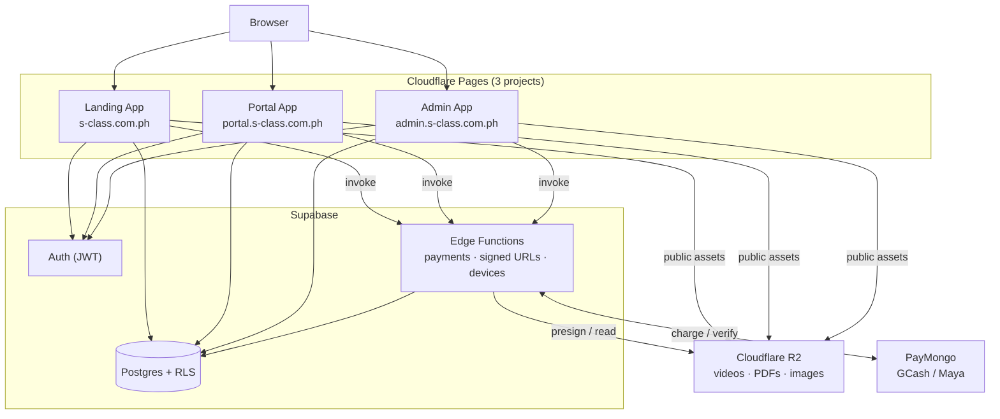

# S Class — eLearning Review Platform

**S Class** (`s-class.com.ph`) is a subscription-based eLearning platform for
**Filipino professional board-exam reviewers**. It delivers premium video
lessons, PDF reviewers, and scored quizzes behind a paywall, sells hardcopy
review books, and limits account sharing — built on React 19, Supabase, and
Cloudflare.

- **Target users:** students reviewing for board exams, guests sampling free
  previews, and admins managing content/sales.
- **Core purpose:** monetize structured review content via subscriptions while
  keeping premium media private and the codebase split cleanly by audience.

> 📚 **This README is an entry point, not the manual.** The full technical
> knowledge base lives in **[`docs/`](docs/README.md)** — start there for
> anything beyond a quick orientation.

---

## Architecture overview

Three independently deployed React apps share one source tree and a Supabase
backend, with media on Cloudflare R2.



See [`docs/overview.md`](docs/overview.md) and
[`docs/system-map.md`](docs/system-map.md) for detail.

---

## Repository structure

This is an **npm-workspaces monorepo** mid-migration from a single SPA into three
subdomain apps plus shared packages.

| Path | What it is |
|---|---|
| `apps/` | The three runnable Vite apps (`landing`, `portal`, `admin`) — the deploy units. |
| `packages/` | Shared `@s-class/*` libraries: `api`, `auth`, `config`, `constants`, `types`, `ui`. |
| `src/` | Shared **source library** (pages, features, layouts) consumed by the apps via the `@` alias. **Not a runnable app.** |
| `supabase/` | Backend: `schema.sql`, `migrations/`, Edge `functions/`, `seed/`, `config.toml`. |
| `docs/` | The full technical knowledge base (start at [`docs/README.md`](docs/README.md)). |
| `functions/` | Cloudflare Pages Functions (public R2 asset proxy). |

Full map: [`docs/repository-structure.md`](docs/repository-structure.md).

---

## Applications

| App | Subdomain | Purpose |
|---|---|---|
| **Landing** (`apps/landing`) | `s-class.com.ph` | Public marketing, FAQ/About/Contact, book storefront (browse), pricing, and the `/preview/*` free-lesson funnel. Auth routes redirect to the portal. |
| **Portal** (`apps/portal`) | `portal.s-class.com.ph` | Authenticated learning: dashboard, subjects, lessons, quizzes, subscription, profile, device management, book checkout, and PayMongo callbacks. |
| **Admin** (`apps/admin`) | `admin.s-class.com.ph` | Role-gated CRUD for subjects, lessons, quizzes, books, orders, users, subscriptions, and homepage CMS. |

Architecture detail: [`docs/frontend-architecture.md`](docs/frontend-architecture.md)
· [`docs/backend-architecture.md`](docs/backend-architecture.md).

---

## Documentation

The knowledge base is in **[`docs/`](docs/README.md)**. Key documents:

| Doc | Read it for |
|---|---|
| [`docs/README.md`](docs/README.md) | Index + how to navigate |
| [`docs/overview.md`](docs/overview.md) | Product purpose, goals, status |
| [`docs/tech-stack.md`](docs/tech-stack.md) | Every technology, why & where |
| [`docs/frontend-architecture.md`](docs/frontend-architecture.md) | Routing, state, data flow, design system |
| [`docs/backend-architecture.md`](docs/backend-architecture.md) | APIs, RPCs, Edge Functions, authz |
| [`docs/ai-context.md`](docs/ai-context.md) | Condensed context for AI assistants |
| [`docs/system-map.md`](docs/system-map.md) | Module / route / RPC dependency maps |

Also: [`docs/database/`](docs/database/database-overview.md),
[`docs/business-domains/`](docs/business-domains/README.md),
[`docs/security.md`](docs/security.md),
[`docs/adr/`](docs/adr/README.md).

---

## Local development

### Prerequisites
- **Node.js 20+** (required by Vite 8)
- **npm** (this repo uses npm workspaces — do not use pnpm/yarn)
- **Supabase CLI** (`npm install -g supabase`) — only for DB migrations / Edge Functions

### Install
```bash
# Install once at the repo ROOT — workspaces hoist deps for all apps/packages
npm install
```

### Run
```bash
npm run dev            # all three apps (landing :5174 · portal :5175 · admin :5176)

# …or run one app at a time:
npm run dev:landing    # http://localhost:5174
npm run dev:portal     # http://localhost:5175
npm run dev:admin      # http://localhost:5176
```

### Build, lint, type-check
```bash
npm run build:landing  # tsc --noEmit && vite build → apps/landing/dist
npm run build:portal   # → apps/portal/dist
npm run build:admin    # → apps/admin/dist
npm run lint           # ESLint over the repo
npm run type-check     # tsc -b + per-workspace type-check
```

> **Run fully offline:** set `VITE_USE_MOCK=true` and `VITE_AUTH_PROVIDER=mock`
> to use local mock data with no backend. Env template: `.env.example`
> (`.env.development` already wires local subdomain URLs).
>
> ℹ️ There is **no test runner** configured, and **no** root `build` / `preview`
> script. Use the per-app commands above.

---

## Environment overview

| Environment | Apps | Backend |
|---|---|---|
| **Development** | 3 Vite dev servers (`localhost:5174/5175/5176`) | shared Supabase project (or local `supabase start`) |
| **Staging** | Cloudflare Pages preview builds (`*.pages.dev`) | **same shared** Supabase project + R2 bucket |
| **Production** | 3 Cloudflare Pages projects → the three subdomains | same shared Supabase project + R2 bucket |

Details, env vars, and the release flow:
[`docs/environments.md`](docs/environments.md) (and `CLOUDFLARE_PAGES.md`).

---

## 🤖 AI Assistant Quick Start

If you are an AI coding assistant (Claude Code, Codex, ChatGPT, etc.):

1. **Read [`docs/ai-context.md`](docs/ai-context.md) first** — before proposing or
   making any architectural change. It is the condensed, high-signal map of this
   repo and lists the areas that must not be modified without caution.
2. Follow the conventions there: import the `*Api.ts` facade (never a provider),
   use `ROUTES` for paths, `@s-class/constants/urls` for cross-subdomain links,
   and read env only via `@s-class/config`.
3. When in doubt about *why* something is the way it is, check
   [`docs/adr/`](docs/adr/README.md).

---

## ⚠️ Important warnings

- **"Course" vs "Subject" are swapped vs. their plain meaning.** A database rename
  made the table `subjects` = the thing students study, and `courses` = the parent
  grouping. **URL strings were intentionally left legacy:** `/courses` lists
  *Subjects*, `/course/:id` is a *Subject*, `/admin/courses` manages *Subjects*,
  and `/admin/categories` manages parent *Courses*. Do not "fix" these.
  → [`docs/adr/0007-course-subject-rename.md`](docs/adr/0007-course-subject-rename.md)
- **One Supabase project + one R2 bucket are shared across all environments.**
  Branch-preview/staging builds run against **production data**. Treat any
  migration or write as production-affecting. → [`docs/environments.md`](docs/environments.md)
- **The database cannot be rebuilt from migrations alone.** A few objects
  (the `quiz_questions` table, the restructured `quizzes` parent, and
  `subjects.thumbnail_url`) were created out-of-band and are missing from
  `supabase/migrations/`. Branch from a production schema dump until a canonical
  baseline exists. → [`docs/database/tables.md`](docs/database/tables.md)
- **The browser is untrusted.** Route guards and tier checks are UX only; the real
  security boundary is Postgres RLS + Edge Functions + 60-second signed URLs.
  → [`docs/security.md`](docs/security.md)

---

## Contributing

1. Branch off `develop` (or `main`); don't commit to the default branch directly.
2. Respect the patterns above; type-check and lint before pushing
   (`npm run type-check`, `npm run lint`).
3. Database changes go in a **new timestamped migration** under
   `supabase/migrations/` (never edit an applied one), with RLS in the same file.
4. Open a PR → Cloudflare Pages preview URLs appear → verify → merge to `main`
   (auto-deploys to production).

Full workflow, recipes, and troubleshooting:
[`docs/developer-guide.md`](docs/developer-guide.md).
