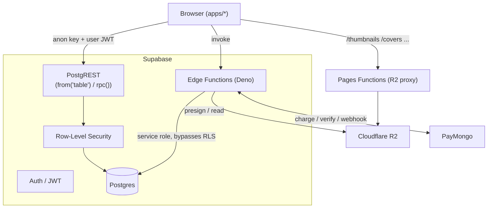
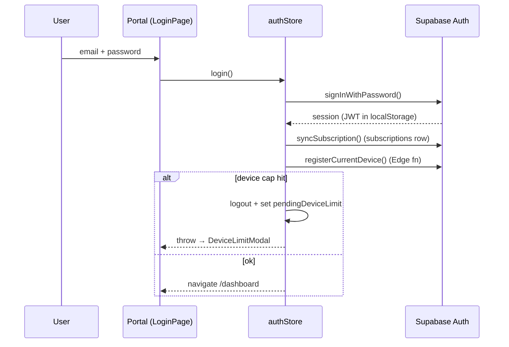
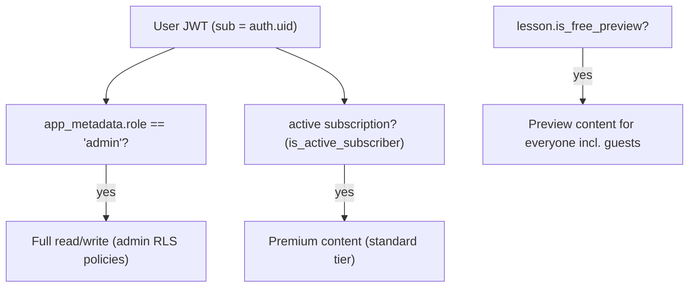
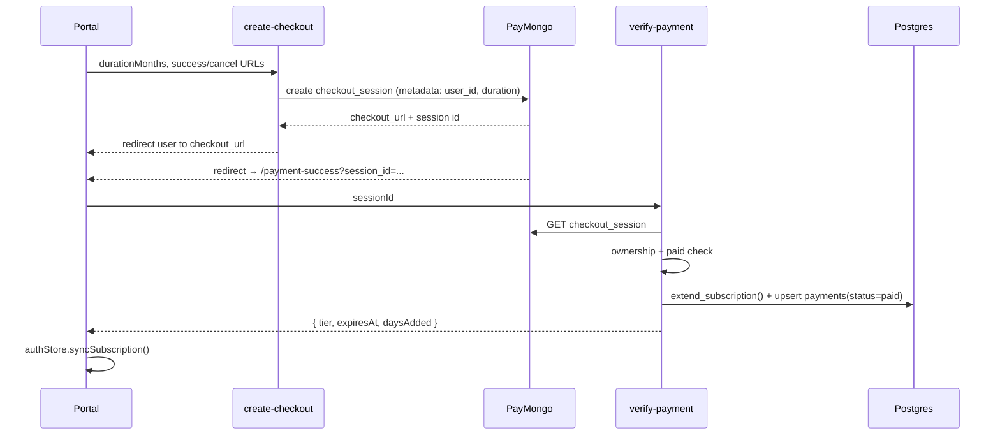
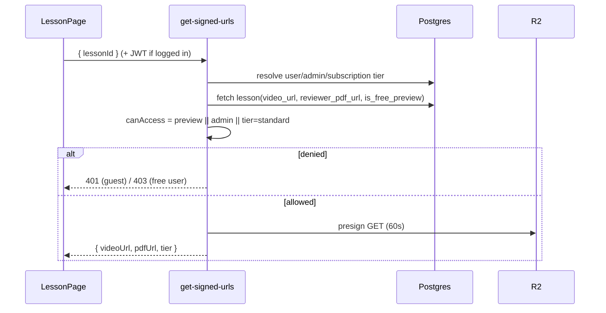

# 5. Backend Architecture

There is **no application server** in this project. "Backend" = **Supabase**
(Postgres + Auth + RLS + Edge Functions) + **Cloudflare R2** (storage) +
**Cloudflare Pages Functions** (public asset proxy) + **PayMongo** (payments).



## API architecture

Two ways the browser talks to data:

1. **PostgREST (direct table/RPC access).** The browser uses the Supabase JS
   client (anon key + the user's JWT). All reads/writes go through **RLS** — the
   JWT identifies the user, policies decide what's allowed. This covers most
   read paths (subjects, lesson previews, quizzes, saved subjects, dashboard
   RPCs, quiz history) and user-owned writes (saved subjects, lesson progress,
   quiz results).
2. **Edge Functions (privileged operations).** Anything needing a secret
   (PayMongo, R2 credentials) or service-role authority (subscriptions,
   device cap, order creation) is a Deno function. These use the
   `SUPABASE_SERVICE_ROLE_KEY` and **bypass RLS** — so they re-implement their
   own authorization in code (verify JWT, check ownership, etc.).

The frontend never calls PostgREST or Edge Functions directly from components —
it goes through the **provider-routed `*Api.ts` facades** in `@s-class/api`
(see [frontend-architecture.md](frontend-architecture.md)).

## Service layer structure (`@s-class/api`)

```text
*Api.ts            facade (mock | supabase | rest switch)   ← UI imports this
  └─ *.service.ts  Supabase implementation (from()/rpc())
  └─ apiClient.ts  REST implementation (fetch + ApiError)
  └─ data/*.ts     mock data
```

| Concern | File |
|---|---|
| Supabase singleton client | `supabaseClient.ts` (anon key from config) |
| REST fetch wrapper + typed errors | `apiClient.ts`, `ApiError.ts` |
| JWT storage | `tokenService.ts` (localStorage) |
| Browser → R2 presigned PUT upload | `storageClient.ts`, `storagePaths.ts` |
| Signed premium content fetch | `secureContent.ts` → `get-signed-urls` |
| Admin CRUD (all domains) | `admin.service.ts` (1266 lines) |
| Per-domain Supabase services | `subject.service.ts`, `lesson.service.ts`, `quiz.service.ts`, `book.service.ts`, `homeContent.service.ts`, `profileService.ts`, `subscriptionService.ts` |

**Business-logic boundaries.** Pricing math lives in `subscriptionService.ts`
**and is mirrored server-side** in `create-checkout`/`verify-payment` (the server
copy is authoritative for charges). Tier→permission mapping is `accessControl.ts`
(client UX) mirrored by the `get-signed-urls` access matrix (authoritative).
Quiz scoring is client-side (`features/quiz/utils.ts`) — results are stored but
the score is computed in the browser (see [security.md](security.md) for the
implication).

## Authentication flow

Provider selected by `VITE_AUTH_PROVIDER` (`mock`/`rest`/`supabase`;
`firebase` is a stub). Production = `supabase`.



- **Registration** writes profile metadata (first/last name, mobile, school,
  schoolId) into `raw_user_meta_data`; the `handle_new_user` trigger creates the
  `profiles` row. If email confirmation is on, `confirmationPending=true`.
- **Password reset** exists: `ForgotPasswordPage` → `resetPasswordForEmail` with a
  cross-subdomain `redirectTo`; `ResetPasswordPage` handles the `PASSWORD_RECOVERY`
  event (deliberately outside `PortalGuestRoute`). *(This contradicts
  `DOCUMENTATION.md` "no password reset" — the flow now exists.)*
- **Sessions** persist in `localStorage` **per origin**. This is why all auth
  happens on `portal.*` (landing redirects there) and admin has its own
  same-origin `/login` — a session created on landing wouldn't be visible to
  portal.

## Authorization model



- **Admin** is `auth.users.app_metadata.role = 'admin'` — set **only server-side**
  (SQL/dashboard, see `supabase/seed/create_admin.sql`). It cannot be changed from
  the client. Helper `is_admin()` (SECURITY DEFINER) reads `raw_app_meta_data`.
- **Subscriber** is an active, non-expired `subscriptions` row. Helper
  `is_active_subscriber()` / `get_user_tier()`.
- **Free preview** is per-lesson `is_free_preview` (replaced the legacy
  `day_number = 1` rule). It's the only carve-out that grants premium media
  without a subscription, and the only one that works for **anonymous guests**.

Full policy listing: [database/rls-policies.md](database/rls-policies.md).

## Database access patterns

| Pattern | Used for | Auth model |
|---|---|---|
| Direct `from('table').select()` (browser) | published subjects, `lesson_previews`, quizzes (subscriber/preview), saved subjects, payments (own) | RLS |
| RPC `rpc('fn')` (browser) | `get_saved_subjects_progress`, `get_dashboard_stats`, `get_quiz_history` | SECURITY DEFINER + `auth.uid()` |
| Service-role `from()/rpc()` (Edge fn) | subscriptions, book_orders, user_devices, payments writes, `extend_subscription`, `decrement_book_stock` | in-function checks (RLS bypassed) |
| Presigned R2 (Edge fn) | premium video/PDF GET, admin upload PUT | subscription/preview/admin check |

## Edge Functions — responsibilities

| Function | Auth | Writes | Notes |
|---|---|---|---|
| `get-signed-urls` | optional JWT (`verify_jwt=false`) | none | The premium gate. Access matrix by preview/tier/admin; 60 s URLs. |
| `generate-upload-url` | JWT (admin) | none | Presigned PUT for browser→R2 upload. |
| `create-checkout` | JWT | none | PayMongo subscription session; price by duration (server copy). |
| `verify-payment` | JWT | `payments`, `subscriptions` (via `extend_subscription`) | Idempotent (unique `paymongo_id`), ownership-checked. |
| `paymongo-webhook` | webhook signature | `payments`, `subscriptions` | Server-to-server backup of verify. |
| `subscribe` | JWT/service | `subscriptions` | Direct extension (admin/dev). |
| `create-book-checkout` | JWT | `book_orders` (service role), stock via `decrement_book_stock` | Creates order + PayMongo session atomically. |
| `verify-book-payment` | JWT | `book_orders` | Idempotent order confirmation. |
| `book-paymongo-webhook` | webhook signature | `book_orders` | Server-to-server. |
| `register-device` | JWT | `user_devices` | Enforces 1 mobile + 1 desktop (count + partial unique index). |
| `revoke-device` | JWT | `user_devices` | Deactivate to free a slot. |

### Payment flow (subscriptions)



Webhooks (`paymongo-webhook`) provide a server-to-server confirmation path so the
subscription activates even if the user closes the tab before `verify-payment`.
Both paths are **idempotent** via the unique `payments.paymongo_id`. Books mirror
this with their own three functions and `book_orders.paymongo_session_id`.

### Content access flow (premium media)



## Public asset proxy (Cloudflare Pages Functions)

Public images are **not** served from R2's public dev URL. Each app ships
`functions/<prefix>/[[path]].ts` (`thumbnails`, `avatars`, `quizzes`, `covers`)
that call shared `_lib/serveR2.ts`. That helper:
- allow-lists prefixes (`thumbnails/ avatars/ quizzes/ covers/`),
- supports `If-None-Match`/304,
- sets `cache-control: public, max-age=86400, s-maxage=604800`.

The R2 bucket is bound to each Pages project as `R2_BUCKET`. Premium media
(videos, reviewer PDFs) is **never** in an allow-listed prefix — it only flows
through `get-signed-urls`.

## Key backend caveats

- **`quiz_questions` table has no `CREATE TABLE` migration.** RLS policies and
  services reference it, but it was created out-of-band (dashboard). See
  [database/tables.md](database/tables.md) — important for reproducible setup.
- **Migration ordering is mixed** (timestamped + un-timestamped). On a fresh
  `supabase db reset` the legacy `add_*` files run *after* the `20260606*` rename,
  which the rename migration's header explicitly flags as a known inconsistency
  (harmless for incremental prod pushes).
