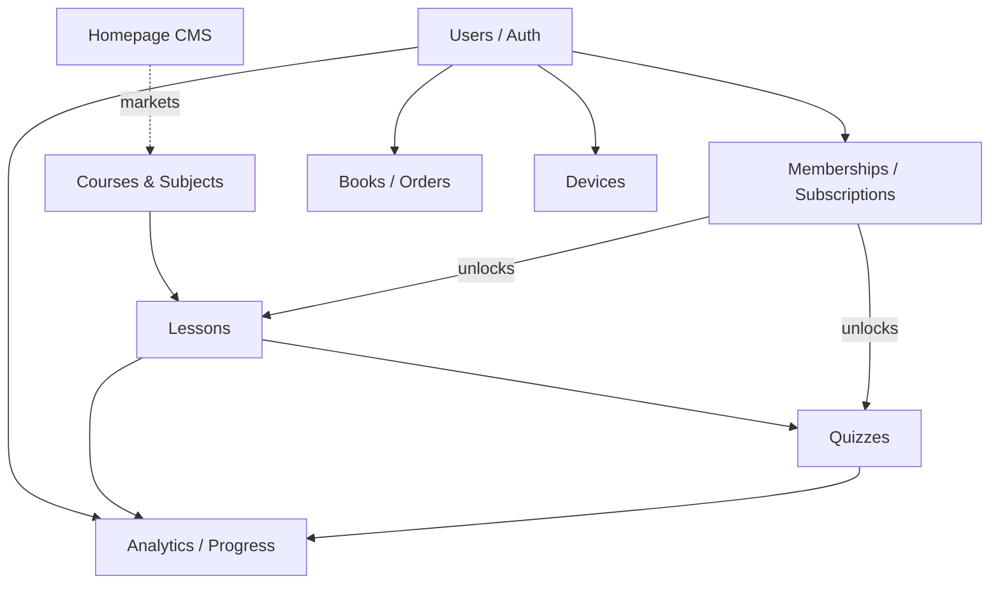

# Business Domains

Each domain doc covers: **purpose · core entities · user journeys · business
rules · dependencies**. Domains map to the data model
([../database/database-overview.md](../database/database-overview.md)) and the
service facades ([../backend-architecture.md](../backend-architecture.md)).

## Domain map

## Index
| Domain | Doc | Core tables |
|---|---|---|
| Users / Auth / Profiles | [users.md](users.md) | `auth.users`, `profiles` |
| Courses & Subjects (catalog) | [courses-subjects.md](courses-subjects.md) | `courses`, `subjects`, `saved_subjects` |
| Lessons | [lessons.md](lessons.md) | `lessons`, `lesson_progress` |
| Quizzes | [quizzes.md](quizzes.md) | `quizzes`, `quiz_questions`, `quiz_results` |
| Memberships / Subscriptions | [memberships.md](memberships.md) | `subscriptions`, `payments` |
| Books / Orders | [books.md](books.md) | `books`, `book_orders` |
| Devices | [devices.md](devices.md) | `user_devices` |
| Homepage CMS | [homepage-cms.md](homepage-cms.md) | `announcements`, `welcome_videos` |
| Analytics / Progress | [analytics.md](analytics.md) | dashboard RPCs, progress, results |

## Cross-domain rules of thumb
- **Subscription is the master gate** for premium lesson media and quizzes,
  with one per-lesson `is_free_preview` exception that even guests can use.
- **CRM** as a distinct domain does **not exist** in the codebase — there is no
  leads/contacts/pipeline system. The closest things are the admin user roster
  (`admin_user_list`) and the contact page (static info, no submission backend).
  Treated here as part of [users.md](users.md). Flagged as a future build in
  [../recommendations.md](../recommendations.md).
- **Notifications** as a domain also does **not exist** server-side. In-app
  feedback is `sonner` toasts only; transactional email (confirm/reset) is handled
  by Supabase Auth. No push/email campaign system.
