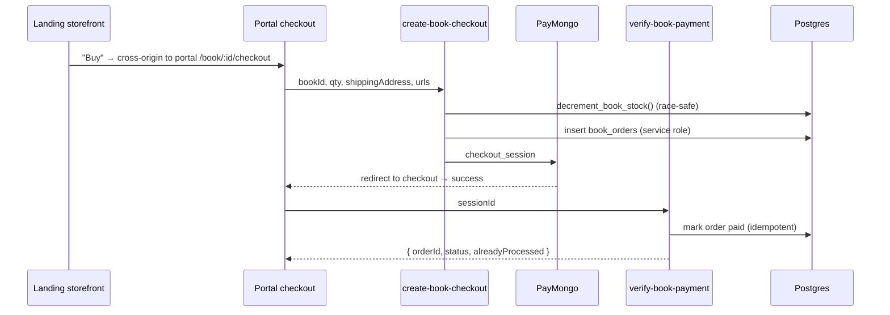

# Domain: Books / Orders (E-commerce)

## Purpose
Sell **hardcopy reviewer books** as a standalone purchase (no link to
subscriptions). Online checkout + payment; **offline/manual fulfillment** (admin
enters a tracking number when shipped).

## Core entities
| Entity | Table | Notes |
|---|---|---|
| Book | `books` | title/author/isbn/description, `cover_url` (R2), `price_centavos`, `stock`, `status` (draft/published/archived) |
| Order | `book_orders` | one book per order (v1): qty, price snapshot, `shipping_address` jsonb, `status`, `paymongo_session_id`, `tracking_no`, lifecycle stamps |
| TS types | `@s-class/types/books` | `Book`, `BookOrder`, `ShippingAddress`, checkout payloads |

## Purchase journey

- **Browse** is public on **landing** (`BooksPage`, `BookDetailPage` — published
  books only). The "Buy" CTA crosses origin to **portal** `/book/:id/checkout`
  (auth required).
- **Checkout** (`BookCheckoutPage`, 361 lines) collects a PH shipping address and
  calls `create-book-checkout`.
- **"My Books"** (`MyBooksCard`) shows the user's orders.

## Business rules
- **Pricing source-of-truth is the DB** (`books.price_centavos`); Edge Functions
  read it at checkout — no hardcoded book prices.
- **Stock is decremented atomically** via `decrement_book_stock()` (row lock,
  race-safe); `restock_book()` restores on cancel.
- **Orders are service-role-created only** — no client INSERT policy (prevents
  forging an order). Users read own; admins read/UPDATE all.
- **Status lifecycle:** `pending → paid → shipped → delivered` (or `cancelled`).
  Price is **snapshotted** at order time so later price changes don't alter history.
- **`books.status`** replaced the old `is_published` boolean: draft (hidden, default),
  published (visible), archived (hidden but retained for historical orders).
- **Eligibility:** any authenticated user can purchase; no subscription required.

## Admin management
- `AdminBooksPage` + `BookModal`: CRUD books, cover upload, stock, status.
- `AdminOrdersPage` + `OrderDetailModal`: view orders, advance status, enter
  `tracking_no` (manual fulfillment).

## Dependencies
- **Users:** orders tied to `auth.users`.
- **Payments/PayMongo:** own three Edge Functions mirroring the subscription flow.
- **Storage (R2):** covers via `/covers` Pages proxy.

## Key files
`apps/landing/src/pages/{BooksPage,BookDetailPage}.tsx`,
`apps/portal/src/pages/BookCheckoutPage.tsx`,
`src/features/books/*`,
`@s-class/api/{booksApi,book.service}.ts`,
`supabase/functions/{create-book-checkout,verify-book-payment,book-paymongo-webhook}`,
`supabase/migrations/20260513000003_add_books_and_orders.sql`,
`apps/admin/src/pages/admin/{AdminBooksPage,AdminOrdersPage}.tsx`.
