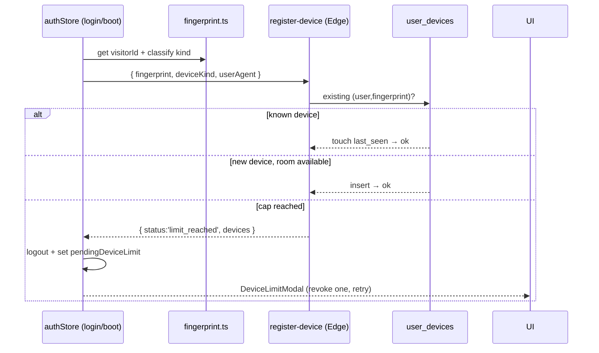

# Domain: Devices (Account-Sharing Limit)

## Purpose
Curb account sharing with a **Netflix-style hard cap: 1 active mobile + 1 active
desktop** per account ("Phase G").

## Core entities
| Entity | Table | Notes |
|---|---|---|
| Device | `user_devices` | `fingerprint` (FingerprintJS), `device_kind` (mobile/desktop), `is_active`, UA/IP/label, seen timestamps |
| TS types | `@s-class/types/devices` | `UserDevice`, `RegisterDeviceBody`, `RegisterDeviceResponse` |

## Journey

`registerCurrentDevice()` runs on **login, register, and every app boot** (after
`initialize`). On `limit_reached` the auth store logs the user out locally and
sets `pendingDeviceLimit` so `DeviceLimitModal` renders. The user can revoke a
device (`revoke-device`) to free a slot and retry. `DevicesPage` lists/labels/
revokes devices.

## Business rules
- **Hard cap enforced two ways:** the Edge Function counts active rows per kind
  **and** a partial unique index `(user_id, device_kind) WHERE is_active`
  rejects a concurrent second insert (`23505` → treated as `limit_reached`).
- **Idempotent re-touch:** the same `(user_id, fingerprint)` updates `last_seen_at`
  rather than creating a new row.
- **Reactivation:** a previously-revoked device can be reactivated only if there's
  room for its kind.
- **Fail-closed:** if the active-device count query errors, the function assumes
  no room (better to false-reject than over-allow).
- **Writes are service-role only** — no client write policy on `user_devices`.
- **Fingerprint drift caveat:** FingerprintJS visitorIds can change on major
  browser/OS updates, risking a false rejection — mitigated by the
  revoke/"sign out other devices" UI.

## Dependencies
- **Users:** device registration is part of the login/boot pipeline; a cap hit
  blocks the session.
- **Edge Functions:** `register-device`, `revoke-device`.

## Key files
`@s-class/api/{devicesApi,fingerprint}.ts`,
`@s-class/auth/authStore.ts` (device pipeline + `pendingDeviceLimit`),
`@s-class/auth/components/DeviceLimitModal.tsx`,
`apps/portal/src/pages/DevicesPage.tsx`,
`supabase/functions/{register-device,revoke-device}`,
`supabase/migrations/20260513000005_add_user_devices.sql`.
