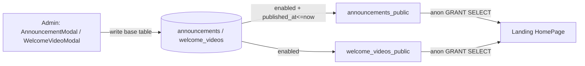

# Domain: Homepage CMS

## Purpose
Let admins edit two dynamic homepage blocks without code changes:
**announcements** (timeline cards) and a **welcome video** card.

## Core entities
| Entity | Table | Public view | Notes |
|---|---|---|---|
| Announcement | `announcements` | `announcements_public` | title/body, `published_at` (schedulable), `enabled`, CTA, `icon` (lucide name), `category`, `display_order` |
| Welcome video | `welcome_videos` | `welcome_videos_public` | title/description, `video_url` (null → static thumbnail card), `thumbnail_url`, CTA, `enabled`, `display_order` |
| TS types | `@s-class/types/home` | — | `Announcement`, `WelcomeVideo` (public shapes only) |

## How it renders

- **Public read** goes through the `*_public` views (anon-readable), filtered to
  `enabled = true` (and announcements additionally `published_at <= now()`).
- **Home** renders announcements sorted by `display_order ASC, published_at DESC`,
  and only the **top enabled** welcome video.
- Fetched via `@s-class/api/homeContentApi` → `homeContent.service.ts`
  (mock fallback in `data/homeMock.ts`).

## Business rules
- **Scheduling:** a future `published_at` with `enabled = true` stays hidden until
  that time (the public view filters `<= now()`).
- **CTA both-or-neither:** DB CHECK requires `cta_label` and `cta_href` to be set
  together or not at all.
- **Multiple welcome videos allowed**, but only one renders — admins keep
  alternates ready to swap.
- **Admin-only writes** via `is_admin()` RLS (`FOR ALL`); the public never touches
  base tables.
- **Seeded content:** the CMS migration seeds three real announcements and one
  default welcome card so production isn't blank post-migration.

## Admin management
`AdminAnnouncementsPage` + `AnnouncementModal`; `AdminWelcomeVideosPage` +
`WelcomeVideoModal` (thumbnail upload via `storageClient` → public CDN URL).

## Dependencies
- **Landing HomePage** consumes it.
- **Storage (R2):** welcome-video thumbnails via the public proxy.

## Key files
`@s-class/api/{homeContentApi,homeContent.service}.ts`,
`apps/landing/src/pages/HomePage.tsx`,
`apps/admin/src/pages/admin/{AdminAnnouncementsPage,AdminWelcomeVideosPage}.tsx`,
`supabase/migrations/20260521000002_add_homepage_cms.sql`.
