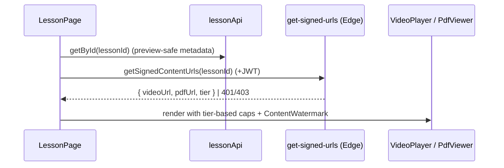

# Domain: Lessons

## Purpose
The actual study unit inside a Subject: a **video** + a **reviewer PDF** + a
**quiz**, sequenced into a Week→Day curriculum. Premium media is access-gated.

## Core entities
| Entity | Table | Notes |
|---|---|---|
| Lesson | `lessons` | `video_url`, `reviewer_pdf_url` (🔒 R2 keys), `order`, `week_number`, `day_number`, `is_free_preview`, durations |
| Lesson preview | `lesson_previews` (view) | premium-safe projection; anon-readable |
| Progress | `lesson_progress` | per-user `is_watched` |
| Reviewer content | `features/lessons/services/reviewerService.ts` | currently mock/stub (summary + key points) |

## User journey — viewing a lesson

`LessonPage` (889 lines, shared in `src/pages`) hosts tabs: **Video**, **Reviewer
(PDF)**, **Quiz**, plus prev/next navigation and the lesson sidebar (`LessonList`).
`useSecureContent` fetches the signed URLs; `useLesson` loads metadata + siblings +
progress; `lessonResumeStorage` remembers playback position.

## Access matrix (authoritative — from `get-signed-urls`)
| Caller | `is_free_preview = TRUE` | `is_free_preview = FALSE` |
|---|---|---|
| Guest (no JWT) | ▶ full (tier=standard) | ❌ 401 |
| Authenticated free | ▶ full | ❌ 403 |
| Subscriber / admin | ▶ full | ▶ full |

The client `VideoPlayer`/`PdfViewer` also enforce **free-tier caps** as UX
(default 30 s video / 5 PDF pages, from `VITE_FREE_*`), but preview lessons always
return `tier=standard` so they play in full.

## Business rules
- **Premium URLs never reach the client except as a 60 s signed URL** from
  `get-signed-urls`. They are excluded from `lesson_previews` and protected by RLS.
- **`is_free_preview`** is the single source of truth for free access (replaced the
  legacy `day_number = 1` rule). Set by admins per-lesson.
- **Order is unique** per subject (`UNIQUE(subject_id, order)`); `week_number` /
  `day_number` drive the curriculum grid and "DAY 1/2…" labels.
- **Progress** ("Mark as watched") is per-user, persisted; feeds dashboard stats.
  Admins can read all progress for completion analytics.
- **Content protection** (deterrents only): `ContentWatermark` overlay,
  `useContentProtection` (DevTools shortcut blocking), `useScreenRecordingDetection`
  — all toggleable via `VITE_PROTECTION_*`. See [../security.md](../security.md).

## Admin management
`AdminLessonsPage` + `LessonModal` (558 lines): pick subject, set title/order/
week/day/durations, toggle `is_free_preview`, upload video (large) + PDF to R2 via
`generate-upload-url` presigned PUT (`storageClient`, progress UI).

## Dependencies
- **Subjects:** a lesson belongs to a subject.
- **Quizzes:** each lesson typically has one quiz.
- **Memberships:** gate premium media.
- **Storage (R2):** media keys; signed delivery.

## Key files
`src/pages/LessonPage.tsx`, `src/features/lessons/*`
(`VideoPlayer`, `PdfViewer`, `useSecureContent`, `useLesson`, `lessonResumeStorage`),
`@s-class/api/{lessonApi,lesson.service,secureContent,lessonProgressApi}.ts`,
`supabase/functions/get-signed-urls`, `apps/admin/.../LessonModal.tsx`.
