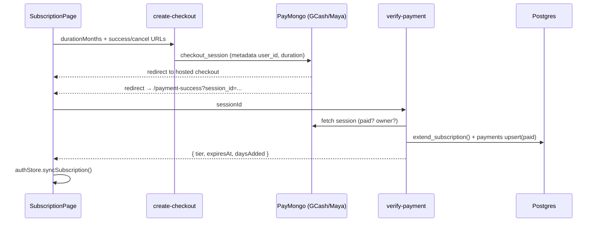

# Domain: Memberships / Subscriptions

## Purpose
Monetization. A **Standard** subscription unlocks full lesson media, all quizzes,
and answer review. Sold as 1/3/6-month plans via PayMongo, with carryover
extension. Free tier = previews + capped media.

## Core entities
| Entity | Table | Notes |
|---|---|---|
| Subscription | `subscriptions` | one per user: `tier`, `duration_months`, `is_active`, `expires_at` (authoritative) |
| Payment | `payments` | PayMongo ledger; idempotency via unique `paymongo_id` |
| ActiveSubscription (TS) | `@s-class/types/subscription` | snapshot: tier, durationMonths, expiresAt, daysRemaining, isExpired |

## Tiers & pricing
| | Free | Standard |
|---|---|---|
| Video | first `VITE_FREE_VIDEO_PREVIEW_SECONDS` (30s) | full |
| PDF | first `VITE_FREE_PDF_MAX_PAGES` (5) | full |
| Quiz answers | hidden | shown |
| Preview lessons | full | full |

Pricing (base `VITE_SUBSCRIPTION_BASE_PRICE` = ₱299/mo): 1mo 0% off · 3mo 10% off ·
6mo 20% off. Computed in `subscriptionService.ts` for UI and **mirrored
server-side** in `create-checkout`/`verify-payment` (centavos: 29900 / 80700 /
143400) — the server copy is authoritative for the charge.

## Purchase journey

A `paymongo-webhook` provides a server-to-server backstop (activates even if the
user abandons the success page). Both paths are **idempotent** (unique
`payments.paymongo_id`) and ownership-checked (`metadata.user_id == auth.uid`).

## Business rules
- **`expires_at` is the only authoritative access field.** `duration_months` is
  for analytics/labels.
- **Carryover extension** (`extend_subscription`): buying while active stacks
  months onto the current expiry; buying after lapse starts fresh from `now()`.
- **Idempotent verification:** safe to call `verify-payment` repeatedly.
- **No client can forge payment:** `payments` has no client write policy; only
  service-role Edge Functions write it.
- **Sync points:** `authStore.syncSubscription()` runs after login, initialize, and
  successful subscribe; only the `isSubscribed` boolean is persisted (snapshot is
  always re-derived).
- **`subscribe` Edge Function** is a direct extension path (admin/dev) bypassing
  PayMongo.

## Known risks
- Legacy RLS lets a user **insert/update their own `subscriptions` row** — should
  be tightened to service-role-only (the Edge Functions already are). See
  [../security.md](../security.md) and [../database/rls-policies.md](../database/rls-policies.md).
- Admin subscription management is **read-only** (`AdminSubscriptionsPage`); no
  manual grant/revoke UI.

## Dependencies
- **Lessons/Quizzes:** subscription unlocks premium content + answers.
- **Users:** subscription tied to `auth.users`.
- **Payments/PayMongo:** the money rail.

## Key files
`src/pages/SubscriptionPage.tsx`,
`src/features/subscription/*` (`useSubscription`, `subscriptionService`, `accessControl`),
`@s-class/api/subscriptionApi.ts`,
`supabase/functions/{create-checkout,verify-payment,paymongo-webhook,subscribe}`,
`supabase/migrations/add_subscription_duration.sql` (`extend_subscription`).
