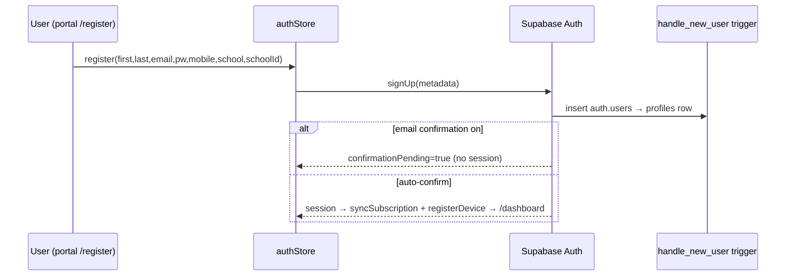

# Domain: Users, Auth & Profiles

## Purpose
Identity for every actor: students, guests (no account), and admins. Owns
registration, login, password recovery, profile data, and the admin role.

## Core entities
| Entity | Where | Notes |
|---|---|---|
| `auth.users` | Supabase Auth | credentials, JWT, `app_metadata.role` (admin flag) |
| `profiles` | `public.profiles` | display data: name, email, mobile, **school/school_id**, role mirror; 1:1, trigger-created |
| `User` (TS) | `@s-class/types/auth` | `id, name, firstName, lastName, email, mobileNumber, school, schoolId, role` |

## User journeys

### Registration

### Login / logout / session restore
- Login on `portal.*` (`signInWithPassword`) → JWT in localStorage →
  `syncSubscription` + `savedSubjects.fetch` + `quizHistory.fetch` +
  `registerCurrentDevice`. Admins are bounced to `admin.*` by `PortalAdminBouncer`.
- `initialize()` restores the session on every app boot **before** routing.
- Logout clears auth + resets dependent stores.

### Password recovery (exists)
`ForgotPasswordPage` → `resetPasswordForEmail(redirectTo)` → email link →
`ResetPasswordPage` handles the `PASSWORD_RECOVERY` event and sets a new password.
It lives **outside** `PortalGuestRoute` because the recovery link creates a
session first.

### Profile management
`ProfilePage` edits name/mobile/school via `profileService`; `authStore.setUser`
patches the in-memory user without a refetch.

## Business rules
- **Admin is server-only.** `role='admin'` lives in `auth.users.app_metadata` and
  can be set just by SQL/dashboard (`supabase/seed/create_admin.sql`). The client
  cannot escalate. `profiles.role` is a mirror kept by the trigger.
- **Sessions are per-origin.** All student auth happens on `portal.*`; landing
  redirects auth routes there; admin has its own same-origin `/login`. A session
  on the wrong origin is invisible to the right app.
- **One profile per user**, trigger-created — never insert into `profiles` directly.
- **Email confirmation** may gate first login (`confirmationPending`). *No
  "resend confirmation" UI exists yet* (improvement).

## Admin sub-domain (closest thing to CRM)
`AdminUsersPage` reads `admin_user_list` (profiles ⨝ subscription status) and can
view/manage users + roles. There is **no separate CRM** (leads, pipeline, notes).

## Dependencies
- **Memberships:** login triggers `syncSubscription`.
- **Devices:** login/register/boot triggers `registerCurrentDevice`; a device-cap
  hit logs the user out and surfaces `DeviceLimitModal`.
- **Analytics:** login fetches saved subjects + quiz history.

## Key files
`@s-class/auth/authStore.ts`, `@s-class/api/authApi.ts` + `authService.ts`,
`profileService.ts`, `apps/portal/src/pages/{Login,Register,ForgotPassword,ResetPassword,Profile}Page.tsx`,
`apps/admin/src/pages/admin/AdminUsersPage.tsx`.
