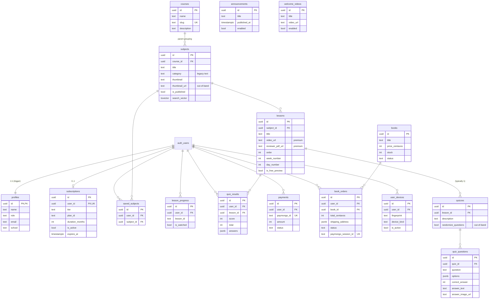

# Database Overview

**Engine:** Supabase Postgres (project `dgnpiexszwsjrqfeefmd`).
**Source of truth:** `supabase/schema.sql` (baseline) + 30 migrations in
`supabase/migrations/` (apply in filename order). This overview reflects the
**cumulative/effective schema** after all migrations.

> The documentation in this folder reconstructs the live schema from the SQL
> migrations **and** the service code that queries it. Two parts of the live
> schema were created **out-of-band** (directly in the Supabase dashboard) and
> have **no migration** — they are flagged everywhere they appear:
> - the **`quiz_questions`** table (and the restructured parent **`quizzes`**)
> - the **`subjects.thumbnail_url`** column
>
> Reproducing the database from migrations alone will **not** produce a working
> quiz schema. See [tables.md](tables.md) §"Schema drift".

## ⚠️ Vocabulary: the Course→Subject rename

Migration `20260606000001_rename_to_course_subject_hierarchy.sql` renamed tables
to match the intended **Course → Subject → Lesson + Quiz** hierarchy:

| Before | After | Meaning |
|---|---|---|
| `courses` | **`subjects`** | the thing students study (e.g. "Engineering Mathematics") |
| `categories` | **`courses`** | the parent grouping (e.g. "Mechanical Engineering Review") |
| `saved_courses` | **`saved_subjects`** | bookmarks |
| `courses.category_id` | `subjects.course_id` | subject → parent course FK |
| `lessons.course_id` | `lessons.subject_id` | lesson → subject FK |

**URL strings were intentionally left legacy.** In code/SQL, "subjects" = the
child table; "courses" = the parent. Keep this in mind for every query below.

## Entity-relationship diagram

`announcements` and `welcome_videos` (homepage CMS) are standalone admin-managed
tables with no FKs; shown separately above.

## Object inventory

| Kind | Count | Detail doc |
|---|---|---|
| Tables (public) | 16 | [tables.md](tables.md) |
| Views | 4 | [views.md](views.md) |
| RPC / functions | 11 | [functions.md](functions.md) · [rpcs.md](rpcs.md) |
| Triggers | ~12 | [triggers.md](triggers.md) |
| Indexes | ~25 | [indexes.md](indexes.md) |
| RLS policies | ~45 | [rls-policies.md](rls-policies.md) |

**Tables:** `profiles`, `courses`, `subjects`, `lessons`, `quizzes`,
`quiz_questions`*, `subscriptions`, `quiz_results`, `saved_subjects`,
`lesson_progress`, `payments`, `books`, `book_orders`, `user_devices`,
`announcements`, `welcome_videos`. (* out-of-band)

**Views:** `lesson_previews`, `admin_user_list`, `announcements_public`,
`welcome_videos_public`.

## Migration history (chronological)

| Order | File | Adds |
|---|---|---|
| 0 | `schema.sql` | profiles, courses, lessons, quizzes, subscriptions, quiz_results; `is_active_subscriber`; `lesson_previews`; base RLS |
| 1 | `add_admin_role.sql` | `profiles.role`, `is_admin()`, admin RLS on courses/lessons |
| 2 | `add_profile_fields.sql` | email/first/last/mobile + `admin_user_list` view |
| 3 | `add_subscription_tiers.sql` | `subscriptions.tier`, `get_user_tier()` |
| 4 | `add_lesson_progress.sql` | `lesson_progress` table |
| 5 | `add_subscription_duration.sql` | `duration_months`, `subscription_days_remaining`, `extend_subscription` |
| 6 | `add_course_search_indexes.sql` | pg_trgm, `difficulty`, `tags`, `search_vector` + GIN indexes |
| 7 | `add_categories.sql` | `categories` table + `courses.category_id` |
| 8 | `add_saved_courses.sql` | `saved_courses`, `get_saved_courses_progress`, `get_dashboard_stats` |
| 9 | `fix_security_advisor.sql` | `lesson_previews` invoker, quizzes/quiz_questions RLS |
| 10 | `admin_read_policies.sql` | admin read on profiles/subscriptions |
| 11 | `add_quiz_answer_fields.sql` | `quiz_questions.answer_text/answer_image_url` |
| 12 | `add_quiz_description.sql` | `quizzes.description` |
| 13 | `add_lesson_duration_minutes.sql` | `lessons.duration_minutes` |
| 14 | `reset_lesson_progress.sql` | maintenance script (DELETE) |
| 15 | `add_payments_table.sql` | `payments` |
| 16 | `20260513000001_add_lesson_week_day` | `week_number`, `day_number` |
| 17 | `20260513000002_add_day_one_free_quiz` | Day-1-free quiz RLS |
| 18 | `20260513000003_add_books_and_orders` | `books`, `book_orders`, `decrement_book_stock`, `restock_book` |
| 19 | `20260513000004_add_profile_school` | `profiles.school/school_id` |
| 20 | `20260513000005_add_user_devices` | `user_devices` + partial unique index |
| 21 | `20260518000001_open_lesson_previews_to_public` | anon-readable previews |
| 22 | `20260518000002_proxy_public_assets_through_pages` | rewrite thumbnail hosts |
| 23 | `20260520000001_quiz_questions_day_one_free` | Day-1-free quiz_questions RLS |
| 24 | `20260520000002_quiz_results_history` | drop unique → full history, `get_quiz_history` |
| 25 | `20260521000000_admin_read_lesson_progress` | admin read progress |
| 26 | `20260521000001_book_status_enum` | `books.status` (draft/published/archived) |
| 27 | `20260521000002_add_homepage_cms` | `announcements`, `welcome_videos` + public views |
| 28 | `20260525000001_repoint_thumbnails_to_landing` | rewrite thumbnail hosts again |
| 29 | `20260605000001_add_lesson_is_free_preview` | `is_free_preview` + RLS swap |
| 30 | `20260606000001_rename_to_course_subject_hierarchy` | the big rename |

> **Not represented in migrations:** the `quiz_questions` table creation, the
> restructure of `quizzes` into a parent (lesson_id + description +
> `randomize_questions`), and `subjects.thumbnail_url`. These exist in production
> but were applied via the dashboard.
