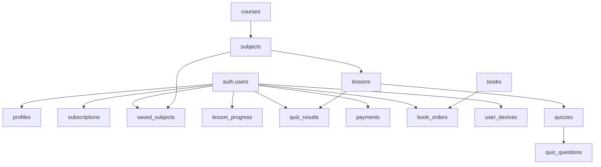

# Relationships

All foreign keys in `public`, post-rename. `auth.users` is Supabase-managed.

## FK catalog

| Child table.column | → Parent | On delete | Notes |
|---|---|---|---|
| `profiles.id` | `auth.users.id` | CASCADE | also the PK (1:1) |
| `subscriptions.user_id` | `auth.users.id` | CASCADE | UNIQUE (1 per user) |
| `saved_subjects.user_id` | `auth.users.id` | CASCADE | |
| `saved_subjects.subject_id` | `subjects.id` | CASCADE | was `course_id` |
| `lesson_progress.user_id` | `auth.users.id` | CASCADE | `lesson_id` is **text, not FK** |
| `quiz_results.user_id` | `auth.users.id` | CASCADE | |
| `quiz_results.lesson_id` | `lessons.id` | CASCADE | |
| `payments.user_id` | `auth.users.id` | CASCADE | |
| `book_orders.user_id` | `auth.users.id` | CASCADE | |
| `book_orders.book_id` | `books.id` | **RESTRICT** | keeps historical orders resolvable |
| `user_devices.user_id` | `auth.users.id` | CASCADE | |
| `subjects.course_id` | `courses.id` | SET NULL | was `category_id`; constraint renamed `subjects_course_id_fkey` |
| `lessons.subject_id` | `subjects.id` | CASCADE | constraint renamed `lessons_subject_id_fkey` |
| `quizzes.lesson_id` | `lessons.id` | CASCADE | |
| `quiz_questions.quiz_id` | `quizzes.id` | (assumed CASCADE) | table is out-of-band; FK inferred from usage |

## Cardinality summary

- **Course (1) → (N) Subjects → (N) Lessons → (≈1) Quiz → (N) Questions.** A
  lesson can technically have multiple `quizzes` rows, but the app treats one quiz
  per lesson (`quiz.service.getQuiz(lessonId)` fetches the first).
- **User (1) → (0..1) Subscription**, (N) saved subjects, (N) progress rows,
  (N) quiz attempts, (N) payments, (N) book orders, (N) devices.
- **Book (1) → (N) Orders** with RESTRICT delete so an order's `book_id` always resolves.

## Non-FK linkage (watch out)

- `lesson_progress.lesson_id` is **`text`** — joins to `lessons.id` cast
  `l.id::text = lp.lesson_id` (see `get_saved_subjects_progress`). There is no
  referential integrity here; orphaned progress rows are possible if a lesson is
  deleted.
- The `subjects.category` **text** column denormalizes the parent course name
  alongside the real `course_id` FK — a legacy field kept until cleanup.
