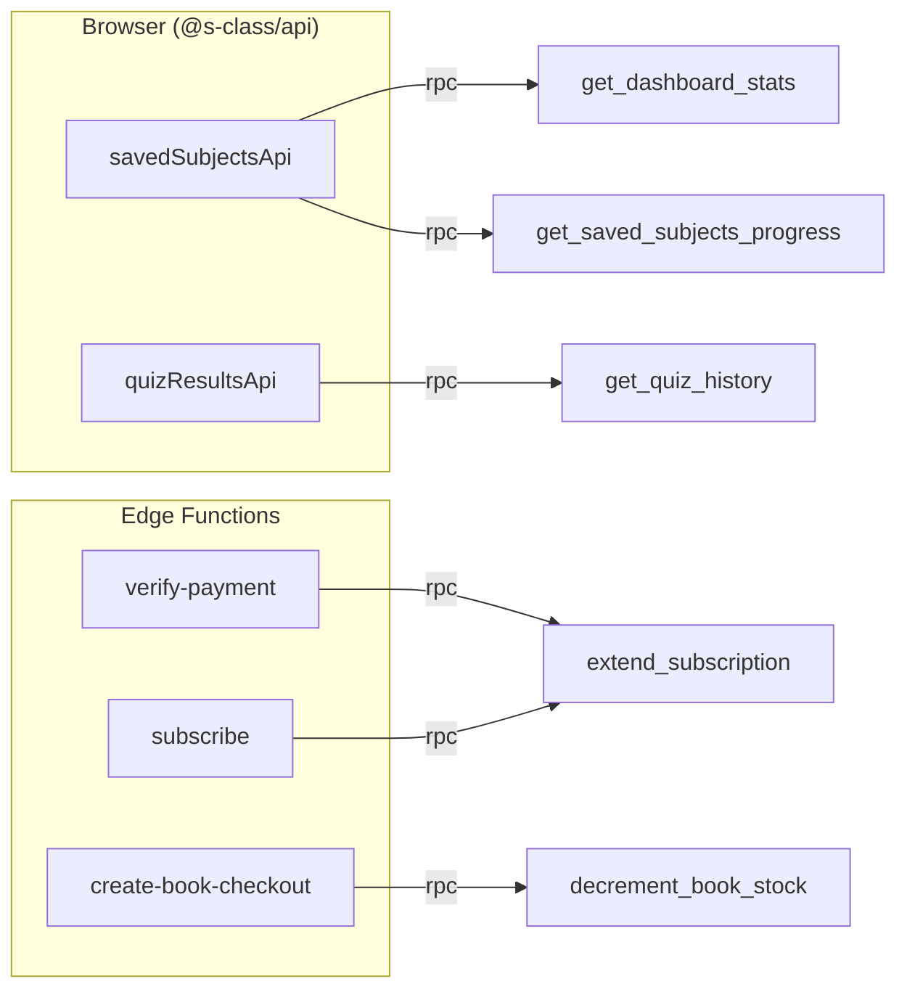

# RPC Usage Map

"RPC" = a Postgres function callable from the client via PostgREST
(`supabase.rpc('name')`) **or** invoked by an Edge Function. This page maps each
to its caller in code.

## Client-callable RPCs (browser → PostgREST)

| RPC | Called by (code) | Feature |
|---|---|---|
| `get_dashboard_stats()` | `savedSubjectsApi` / `useSavedSubjectsStore` | Dashboard stat cards |
| `get_saved_subjects_progress()` | `savedSubjectsApi` | Saved subjects + progress bars |
| `get_quiz_history(limit)` | `quizResultsApi` / `useQuizHistoryStore` | Quiz history page |

These are `GRANT EXECUTE … TO authenticated` and self-scope to `auth.uid()`, so
RLS-style protection lives inside the function body.

## Edge-Function-invoked RPCs (service role → PostgREST)

| RPC | Invoked by | Why server-side only |
|---|---|---|
| `extend_subscription(user, months, tier)` | `verify-payment`, `subscribe` | activates/extends a paid subscription — must not be client-callable |
| `decrement_book_stock(book, qty)` | `create-book-checkout` | atomic, race-safe stock reservation |
| `restock_book(book, qty)` | book cancel path (admin) | restore stock on cancellation |

## Not RPCs, but worth noting
The bulk of data access is **direct table access** through PostgREST
(`supabase.from('table')`), not RPC — see
[../backend-architecture.md](../backend-architecture.md) "Database access
patterns". RPCs are used only where a single round-trip aggregate or a privileged
write is needed.

## RPC call graph

## Drift note
Per the rename migration, the three dashboard RPCs changed **return shapes**
(`course_id`→`subject_id`, JSON key `courses_saved`→`subjects_saved`). Any old
client code expecting the previous keys would break — current `@s-class/api`
mappers expect the new shape.
