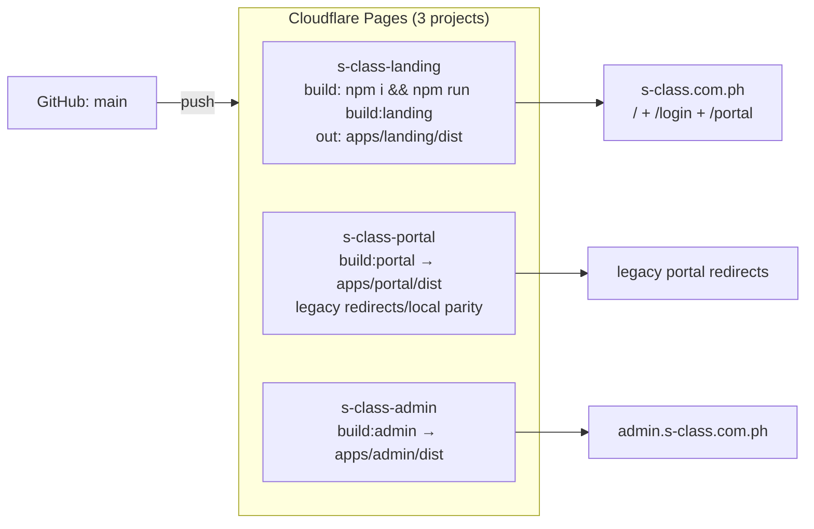
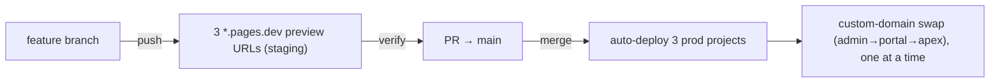

# 8. Environments

Three coarse environments, surfaced in code as `config.appEnv`
(`@s-class/config`): `local` | `staging` | `production`. Dev builds always
resolve to `local` (`import.meta.env.DEV`); otherwise `VITE_APP_ENV` decides.

## Environment matrix

| | Local | Staging | Production |
|---|---|---|---|
| **Apps** | 3 Vite dev servers | Pages preview projects | Pages projects |
| **Landing** | `localhost:5174` | `*.s-class-landing.pages.dev` | `s-class.com.ph` (`/`, `/login`, `/portal`) |
| **Portal** | `localhost:5175` | `*.s-class-portal.pages.dev` | local/legacy redirect compatibility |
| **Admin** | `localhost:5176` | `*.s-class-admin.pages.dev` | `admin.s-class.com.ph` |
| **`VITE_APP_ENV`** | (ignored; DEV) | `staging` | `production` |
| **Supabase** | shared project `dgnpiexszwsjrqfeefmd` (or local `supabase start`) | **same shared project** | same shared project |
| **R2** | shared bucket | shared bucket | shared bucket |
| **PayMongo** | test keys | test keys | live keys |

> ⚠️ **One Supabase project + one R2 bucket are shared across all environments.**
> Branch previews run against **production data**. There is no isolated
> staging/test database. This is a deliberate small-team trade-off and a risk —
> see [recommendations.md](recommendations.md).

## Deployment targets (production)



Each project builds **from the monorepo root** (`Root directory = /`) so npm
workspaces resolve; the per-app `build:*` script runs Vite from the app subdir.
Node 20+ required (Vite 8). Full dashboard checklist: `CLOUDFLARE_PAGES.md`.

## Environment variables

`.env` is git-ignored; `.env.example` is the template; `.env.development`
(committed) sets local app URLs. `@s-class/config` is the **only** sanctioned
reader of `import.meta.env`.

### Browser vars (`VITE_*` — bundled into the client)
| Var | Purpose | Required when |
|---|---|---|
| `VITE_AUTH_PROVIDER` | `mock`\|`rest`\|`supabase`\|`firebase`(stub) | always (prod=`supabase`) |
| `VITE_USE_MOCK` | bypass network, use mock data | optional |
| `VITE_API_BASE_URL` | REST base URL | REST mode only |
| `VITE_SUPABASE_URL` / `VITE_SUPABASE_ANON_KEY` | Supabase project + public anon key | supabase mode |
| `VITE_LANDING_URL` / `VITE_ADMIN_URL` | cross-origin links | **required in PROD** (build throws if missing) |
| `VITE_PORTAL_URL` | deprecated | optional; student portal uses `VITE_LANDING_URL` under `/portal` |
| `VITE_APP_ENV` | `staging`\|`production` | prod/staging |
| `VITE_SUBSCRIPTION_BASE_PRICE` / `VITE_SUBSCRIPTION_CURRENCY` | pricing display | always |
| `VITE_FREE_VIDEO_PREVIEW_SECONDS` / `VITE_FREE_PDF_MAX_PAGES` | free-tier caps | always |
| `VITE_CONTENT_PROTECTION_ENABLED` + `VITE_PROTECTION_*` | content-protection toggles | optional (default on) |
| `VITE_FIREBASE_*` | Firebase (stub provider) | never (no impl) |

> `urls.ts` **throws at module load in PROD** if the landing or admin URL is
> missing — a guard against shipping cross-origin links that point at the wrong env.

### Server secrets (NEVER `VITE_*`)
Set on Supabase via `supabase secrets set` (Edge Functions) or as Cloudflare
Pages bindings — never in `.env`/the browser bundle:

| Secret | Where | Used by |
|---|---|---|
| `SUPABASE_SERVICE_ROLE_KEY` | injected by Supabase | all Edge Functions |
| `PAYMONGO_SECRET_KEY` | `supabase secrets set` | create/verify checkout |
| `PAYMONGO_WEBHOOK_SECRET` | `supabase secrets set` | webhook signature verify |
| `R2_ACCOUNT_ID` / `R2_ACCESS_KEY_ID` / `R2_SECRET_ACCESS_KEY` / `R2_BUCKET_NAME` | `supabase secrets set` | signed URLs + uploads |
| `R2_BUCKET` (binding) | Cloudflare Pages → Functions | public asset proxy |

## Build process
- Per app: `tsc --noEmit -p tsconfig.json && vite build` → `apps/<app>/dist`.
  The TS check **fails the build on any type error**.
- Root: `tsc -b` (project refs) + `npm run type-check --workspaces`.
- `@` alias → repo-root `src`; `publicDir`/`envDir` → repo root (per app `vite.config.ts`).

## Release flow


- **Branch pushes** auto-deploy preview URLs used as staging (set
  `VITE_APP_ENV=staging` + matching landing/admin `*.pages.dev` URLs in the
  Preview env).
- **Merge to `main`** → production deploy of all three.
- **Post-deploy:** add prod URLs to Supabase Auth (Site URL + Redirect URLs) and
  R2 CORS; `supabase functions deploy`; `supabase db push`.
- **Domain swap** keeps admin separate and points the apex at the landing build,
  which now serves `/portal` as well (`CLOUDFLARE_PAGES.md`).

## Local development
```bash
npm install            # once, at repo root (workspaces)
npm run dev            # all three apps (concurrently): 5174/5175/5176
# or individually:
npm run dev:landing    # :5174
npm run dev:portal     # :5175
npm run dev:admin      # :5176
```
`.env.development` already points landing/admin URLs at localhost ports. To run fully
offline: `VITE_USE_MOCK=true` + `VITE_AUTH_PROVIDER=mock`.
