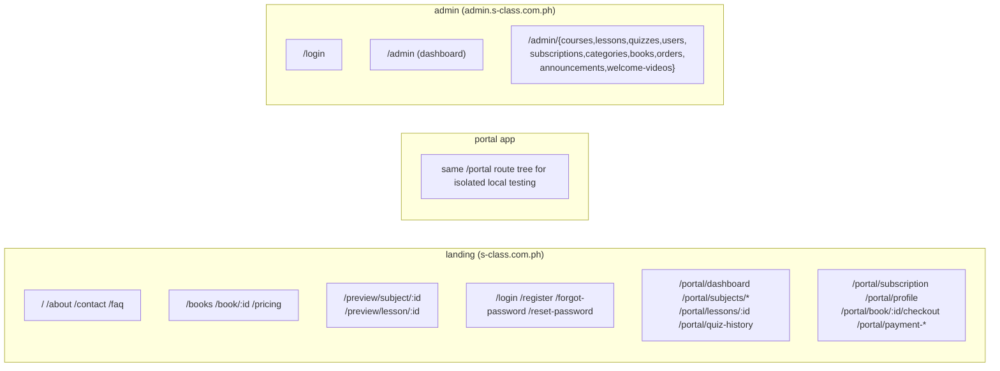
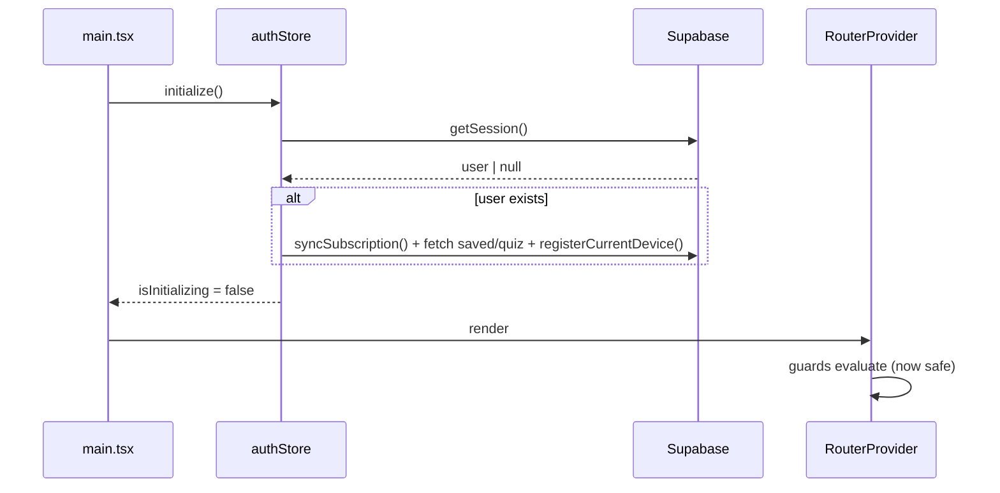

# 4. Frontend Architecture

Three React 19 app workspaces (`apps/landing`, `apps/portal`, `apps/admin`) share
one source tree (`src/*` via `@` alias) and six `@s-class/*` packages. Production
deploys Landing/Website and Admin; `apps/portal` remains as source and an
isolated local test app. This document describes the patterns common to all
three workspaces.

## Request path (the spine)

```text
main.tsx
  → authStore.initialize()          # restore Supabase session BEFORE routing
  → RouterProvider (createBrowserRouter)
    → layout route / route guard     # GuestRoute | Protected | bouncer
      → page (src/pages or apps/*/pages)
        → feature component / hook    # src/features/*
          → domain API facade         # @s-class/api  *Api.ts
            → provider                 # mock | supabase service | REST apiClient
              → Supabase / R2 / REST
```

## Routing architecture

Each app declares its own routes once with `createBrowserRouter` in
`apps/<app>/src/app/router.tsx`. **Student-facing route ownership is same-origin
under the landing app** and encoded in `@s-class/constants/urls`
(`getRouteOwner`, `ADMIN_PREFIXES`).



**Legacy URL caveat (critical):** old student URLs (`/dashboard`, `/courses`,
`/course/:id`, `/lesson/:id`, `/quizzes`, etc.) redirect into `/portal/*`.
Admin legacy names remain:
- `/admin/courses` → `AdminSubjectsPage` (manages **Subjects**)
- `/admin/categories` → `AdminCoursesPage` (manages parent **Courses**)

Always import paths from `ROUTES` (`@s-class/constants/routes`); never hardcode.

### Cross-origin navigation

Same-origin links use react-router `<Link>`. **Cross-origin** links, including
admin handoffs, PayMongo success URLs, and Supabase `redirectTo`, must be
full-page navigations built from `@s-class/constants/urls`:
`EXTERNAL.portal()`, `EXTERNAL.loginPage()`, `getAbsoluteUrl(path)`. Student
portal helpers now resolve to the landing origin plus `/portal/*`; admin remains
separate.

## Route guards & session bootstrap

Guards are implemented as **layout routes** (an element with `<Outlet/>` children).
The same conceptual guards exist per app, named per app:

| Guard | Package/app | Behavior |
|---|---|---|
| `ProtectedRoute` / `PortalProtectedRoute` / `AdminProtectedRoute` | `@s-class/auth` + per-app | Require a session; else redirect to login (preserving `location.from`). Admin variant also requires `role==='admin'`. |
| `GuestRoute` / `PortalGuestRoute` / `AdminGuestRoute` | `@s-class/auth` + per-app | Kick already-authenticated users to their home (`/dashboard`, `/admin`). |
| `PortalAdminBouncer` | portal/student routes | Sends authenticated **admins** off student routes → `admin.*`. |
| `AdminGuestRoute` | admin | Sends authenticated **non-admins** off admin → portal. |
| `PreviewBouncer` | portal app local parity | Sits ahead of old `/course/:id` and `/lesson/:id`; forwards **guests** on free-preview targets to landing's `/preview/*` (keeps old bookmarks working during local/manual checks). |

**The bootstrap rule that prevents the "flash to /login on refresh" bug:** every
app calls `useAuthStore.getState().initialize()` **before** rendering
`RouterProvider`. `initialize()` restores the Supabase session and only then sets
`isInitializing=false`. Guards must not redirect while `isInitializing` is true.
Do not bypass this.



## Layout system

| Layout | Where | Wraps |
|---|---|---|
| `RootLayout` | `apps/landing` | Marketing Navbar + `<Outlet/>` + footer/background. |
| `PortalRootLayout` | `apps/portal` | Top-level portal shell (above per-page guards). |
| `PortalLayout` (372 lines) | `src/layouts` | Sidebar shell for dashboard/quizzes/subscription/profile/portal-subjects. Nav from `src/layouts/portalNav.ts`. |
| `AdminLayout` (371 lines) | `apps/admin/features/admin` | Collapsible sidebar + header; `NAV_ITEMS` keyed on `ROUTES.ADMIN_*`. |
| `SiteBackground` | `src/components` | Shared decorative background. |

## Component hierarchy & feature modules

Feature code is **colocated** under `src/features/<name>/` with
`components/ hooks/ services/ data/ types.ts`:

| Feature | Notable pieces |
|---|---|
| `lessons` | `VideoPlayer` (527), `PdfViewer` (211), `LessonCTAs`, `UpgradeOverlay`, `ReviewerSection`, `LessonList`; hooks `useLesson`, `useSecureContent`; `lessonResumeStorage` (resume position). |
| `quiz` | `QuizComponent` (358), `ResultSummary`; `useQuiz`; scoring `utils.ts`. |
| `subjects` | `SubjectCard`, `SubjectList`, `SavedSubjectCard`, `curriculum.tsx` (Week→Day grid); `useSubjects` (250) does search/filter/sort. |
| `subscription` | `useSubscription`, `subscriptionService` (pricing), `accessControl` (tier→permissions), `SubscribedRoute`. |
| `books` | `BookCover`, `MyBooksCard`. |

Admin "features" live under `apps/admin/src/features/admin/components/` as large
modal forms (`QuizModal` 1004, `LessonModal` 558, `BookModal`, etc.) + `AdminTable`.

## State management (Zustand)

Four stores; three in `@s-class/auth`, one in `src/store`:

| Store | Persisted? | Holds |
|---|---|---|
| `useAuthStore` (`@s-class/auth/authStore`, 265 lines) | partial (`isSubscribed` only) | `user`, `isAuthenticated`, `isAdmin`, `isSubscribed`, `subscription`, `isInitializing`, `confirmationPending`, `pendingDeviceLimit`. Actions: `initialize/login/register/logout/syncSubscription/refreshToken/setUser`. |
| `useSavedSubjectsStore` | no | saved subject ids, per-subject progress, dashboard stats. **Optimistic updates with rollback**. |
| `useQuizHistoryStore` | no | quiz attempt history (`get_quiz_history` RPC). |
| `quizStore` (`src/store/quizStore.ts`) | no | transient active-quiz answers + scored result. |

`authStore` is the orchestrator: on login/register/initialize it calls
`syncSubscription()`, kicks off `savedSubjects.fetch()` + `quizHistory.fetch()`,
and `registerCurrentDevice()`. On a `DeviceLimitError` it logs out locally and
sets `pendingDeviceLimit` so the UI can render `DeviceLimitModal`. Only the
`isSubscribed` boolean is persisted — the full subscription snapshot is always
re-derived from Supabase on startup (avoids stale persisted expiry).

## Data flow — the provider-routed facade

Every domain exposes a `*Api.ts` facade in `@s-class/api`. UI/hooks import the
facade, never a provider. Example (`subjectApi.ts`):

```ts
export const subjectApi = {
  async getAll(): Promise<Subject[]> {
    if (config.api.useMock)                  return SUBJECTS            // mock
    if (config.auth.provider === 'supabase') return subjectService.getSubjects()  // Supabase
    return apiClient.get<Subject[]>('/courses')                        // REST
  },
  // getById, getByIdAdmin ...
}
```

Selected by env (`@s-class/config`): `VITE_USE_MOCK=true` → mock;
`VITE_AUTH_PROVIDER=supabase` → Supabase service; else REST. See
[adr/0005-provider-routed-service-layer.md](adr/0005-provider-routed-service-layer.md).
Facades: `authApi`, `subjectApi`, `coursesApi`, `lessonApi`, `lessonProgressApi`,
`quizApi`, `quizResultsApi`, `savedSubjectsApi`, `subscriptionApi`, `booksApi`,
`devicesApi`, `homeContentApi`.

## Form architecture

No form library. Forms are **controlled components with local `useState`** and
manual validation, surfacing errors via the `ErrorMessage` component or `sonner`
toasts. Admin CRUD forms are large bespoke modals (e.g. `QuizModal`,
`LessonModal`) that own their own state, file-upload progress, and submit logic
calling `admin.service.ts`. This is the biggest single source of large-component
debt — see [technical-debt.md](technical-debt.md).

## Error handling

- **REST:** `apiClient` throws a typed `ApiError` with `.isUnauthorized`,
  `.isForbidden`, `.isNotFound`.
- **Supabase:** every call returns `{ data, error }`; code checks `error` before
  using `data`.
- **Signed-content:** `getSignedContentUrls` throws `SecureContentFetchError`
  (carries the HTTP status so the UI can distinguish 401/403/404).
- **User surface:** inline `ErrorMessage` (forms) or `sonner` toasts (`src/lib/toast.ts`).

## Permissions handling (client side = UX only)

| Layer | Mechanism |
|---|---|
| Route visibility | Guards (`Protected*`/`Guest*`) + admin bouncers. |
| Feature gating | `authStore.isSubscribed` / `subscription.tier`; `accessControl.ts` maps tier → `TierPermissions` (video seconds, PDF pages, quiz answers). |
| Free-preview | Server-set `lesson.is_free_preview`; client reads it from `lesson_previews` to decide preview affordances. |

⚠️ All client permission checks are deterrents. The authoritative checks are RLS
and the `get-signed-urls` Edge Function — see [security.md](security.md).

## Design system

- **Tailwind v4** via `@tailwindcss/vite`, no PostCSS. Theme tokens in `src/index.css`.
- **`cn()`** (clsx + tailwind-merge) for conditional class merge — used everywhere.
- **Primitives** in `@s-class/ui` (CVA variants + Radix `Slot`): `button`, `input`,
  `badge`, `skeleton`, `ErrorMessage`, `PageLoader`. shadcn-style (`components.json`).
- Prefer canonical utilities (`w-15`) over arbitrary values (`w-[60px]`).
- **Duplication note:** `src/components/ui/*` are legacy copies of the same
  primitives now in `@s-class/ui`. New code should prefer the package.

## Architectural patterns in use

- **Facade / provider strategy** (data layer swappability).
- **Layout-route guards** (declarative auth gating).
- **Store-orchestrated bootstrap** (auth store fans out to other stores + device reg).
- **Optimistic UI with rollback** (saved subjects).
- **Server-authoritative gating** (signed URLs / RLS; client mirrors for UX).
- **Monorepo with shared source library** (apps reuse `src/*` via alias during migration).
