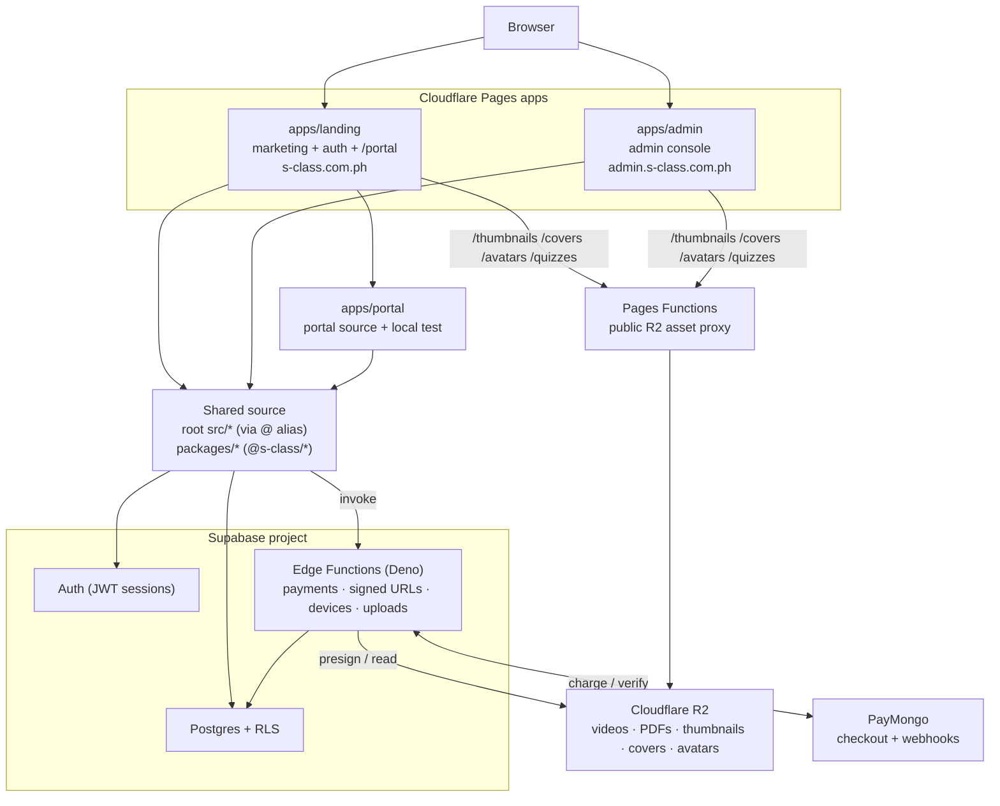

# 1. Executive Overview

## Project purpose

**S Class** (`s-class.com.ph`) is a subscription-based eLearning **review
platform for Filipino professional board-exam candidates**. The seeded content
and marketing copy target the **Mechanical Engineering board review** market
(Engineering Mathematics, Machine Design, Power & Industrial Plant Engineering),
but the data model is generic enough for any board-review program.

It delivers structured study content behind a paywall:

- **Video lessons** (HTML5 player with free-tier preview caps)
- **PDF reviewers** (page-limited viewer for free tier)
- **Per-lesson quizzes** (multiple-choice, scored, with answer review for paying users)
- **Progress tracking** (saved subjects, watched lessons, quiz history)
- **Hard-copy book sales** (e-commerce with offline/manual fulfillment)

The codebase is internally branded **"S Class"** / `@s-class/*` workspace
packages; the GitHub repository is named `elearning-review-platform`.

## Business goals

| Goal | How the platform serves it |
|---|---|
| **Monetize review content via subscriptions** | Standard tier unlocks full videos/PDFs/quiz answers; 1/3/6-month plans with multi-month discounts, paid through PayMongo (GCash / Maya). |
| **Convert browsers into subscribers** | A public marketing site + free-preview funnel (`/preview/*`) lets guests sample flagged lessons before signing up. |
| **Protect premium content** | Media is never public: short-lived (60 s) signed R2 URLs are issued by an Edge Function only after a server-side subscription check. |
| **Add a physical product line** | Sell printed reviewers (books) with stock control and manual shipping/tracking. |
| **Limit account sharing** | Netflix-style hard cap of 1 active mobile + 1 active desktop device per account. |
| **Operate cheaply at small scale** | Serverless everything (Supabase + Cloudflare Pages/R2) — no servers to run. |

## Target users

| User | Description | Where they live |
|---|---|---|
| **Reviewer / student** | A board-exam candidate studying via video + PDF + quizzes. | `s-class.com.ph/portal` served by `apps/landing`, using `apps/portal` source |
| **Guest / prospect** | An unauthenticated visitor browsing marketing pages, the book store, and free preview lessons. | `apps/landing` |
| **Administrator** | Staff who manage courses/subjects/lessons/quizzes/books/orders/users/CMS. | `apps/admin` (role-gated) |

## High-level architecture



**The defining architectural ideas:**

1. **Provider-routed service layer.** Every data domain has a `*Api.ts` facade
   that fans out to mock / REST / Supabase backends based on env flags. UI never
   imports a backend directly. See
   [adr/0005-provider-routed-service-layer.md](adr/0005-provider-routed-service-layer.md).
2. **RLS is the real security boundary.** Route guards and tier checks in React
   are UX only; Postgres Row-Level Security and Edge Functions are what actually
   enforce access. See [security.md](security.md).
3. **Signed-URL content protection.** Premium media URLs are never in client-readable
   tables/views; the `get-signed-urls` Edge Function is the only path to R2 for
   premium content. See [adr/0008-signed-url-content-protection.md](adr/0008-signed-url-content-protection.md).
4. **Split app-shell monorepo.** Separate Cloudflare Pages app shells share one
   source tree and one Supabase backend. Student routes are now same-origin
   under `s-class.com.ph/portal`; admin stays separate. See
   [adr/0004-monorepo-subdomain-split.md](adr/0004-monorepo-subdomain-split.md).

## Major modules

| Module | Lives in | Responsibility |
|---|---|---|
| **Landing app** | `apps/landing` | Public marketing, book storefront (browse), pricing, `/preview/*`, shared auth, and `/portal/*` student routes. |
| **Portal source/local app** | `apps/portal` | Student portal pages/components imported by Landing and available through `npm run dev:portal` for isolated local testing. |
| **Admin app** | `apps/admin` | Role-gated CRUD for subjects/lessons/quizzes/books/orders/users/CMS. |
| **Shared `src/*`** | `src/` | Cross-app pages (`LessonPage`, `SubjectDetailPage`, `SubscriptionPage`), feature components/hooks, portal layout. |
| **`@s-class/api`** | `packages/api` | Browser-safe data layer: Supabase/REST clients, provider routers, services, mocks. |
| **`@s-class/auth`** | `packages/auth` | Zustand auth/saved-subjects/quiz-history stores + route guards. |
| **`@s-class/config`** | `packages/config` | Single sanctioned reader of `import.meta.env`. |
| **`@s-class/constants`** | `packages/constants` | Route strings + cross-origin URL helpers. |
| **`@s-class/types`** | `packages/types` | Shared domain TypeScript types. |
| **`@s-class/ui`** | `packages/ui` | Primitive UI components + `cn()`. |
| **Edge Functions** | `supabase/functions` | 11 Deno functions for payments, signed URLs, devices, uploads. |
| **Database** | `supabase/` | Postgres schema + 30 migrations, RLS, RPCs, views. |

## Key features (current)

- ✅ Email/password auth (Supabase) with email confirmation + **password reset**
- ✅ Public marketing site + FAQ/About/Contact
- ✅ Subject catalog with search/filter/sort + Week→Day curriculum grid
- ✅ Premium video & PDF with free-tier preview caps + signed-URL delivery
- ✅ Per-lesson quizzes with scoring, answer review, and **persisted attempt history**
- ✅ **Free-preview** lessons (per-lesson `is_free_preview` flag; guests included)
- ✅ Subscriptions via **PayMongo** (GCash/Maya), carryover extension, idempotent verification
- ✅ Book storefront + **checkout with stock control** and manual fulfillment
- ✅ Saved subjects, lesson progress, dashboard stats
- ✅ **Device limiting** (1 mobile + 1 desktop) via fingerprint + Edge Function
- ✅ Homepage **CMS** (announcements + welcome video) managed in admin
- ✅ Admin console for all of the above

## Current project status

The project is **pre-/early-production and mid-refactor**. Recent git history is
dominated by **"Phase 4"** — the monorepo/subdomain split:

```
177988e refactor(admin): Phase 4d — extract Admin to apps/admin/
2677f8e refactor(portal): Phase 4c-3 — move dashboard/subjects/quiz cluster to apps/portal/
9d9fd37 refactor(portal): Phase 4c-1 — move auth cluster to apps/portal/
25b87f8 refactor(landing): Phase 4b — move Landing-owned files to apps/landing/
a188dfa feat(portal): Phase 3 — Portal is learning-only
```

What this means for a new developer:

- The **three apps are the runnable units**; the old single SPA on port 5173 is
  gone (no `index.html`/`main.tsx`/`router.tsx` at repo root).
- Shared code is split between **root `src/*`** (still large) and **`packages/*`**.
  A "future decommission phase" is expected to move more of `src/*` into packages.
- **URL strings remain legacy** (`/courses`, `/admin/categories`) even though the
  DB and types now use the Course→Subject vocabulary. A separate URL-migration
  sprint is planned.
- Production deployment now uses **two Cloudflare Pages projects**: Landing/Website
  and Admin. The deployment checklist is in `CLOUDFLARE_PAGES.md`.

See [technical-debt.md](technical-debt.md) for the in-flight cleanup backlog and
[recommendations.md](recommendations.md) for prioritized next steps.
