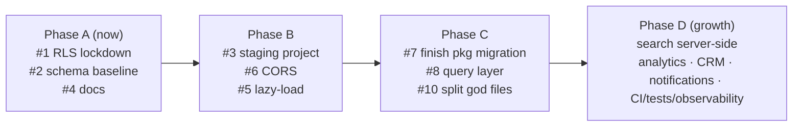

# 15. Recommendations

Ranked by **impact ÷ effort**. Each maps to evidence in
[technical-debt.md](technical-debt.md) / [security.md](security.md) /
[performance.md](performance.md). "Effort" is a rough T-shirt size.

## Impact ranking (do these first)

| # | Recommendation | Impact | Effort | Refs |
|---|---|---|---|---|
| 1 | **Lock down `subscriptions` (and re-audit payment) RLS to service-role-only writes** | 🔴 Critical (revenue/access integrity) | S | [security #1](security.md), TD H2 |
| 2 | **Capture a canonical schema baseline** (`pg_dump --schema-only`) and reconcile migrations | 🔴 High (reproducibility/onboarding) | M | TD H1/H3 |
| 3 | **Stand up a separate staging Supabase project + R2 bucket** | 🔴 High (don't test on prod) | M | [env](environments.md), [security #4](security.md) |
| 4 | **Banner/reconcile the remaining stale root docs** (`DOCUMENTATION.md`, `CLAUDE.md`, `ARCHITECTURE.md`) to point at `docs/` — *root `README.md` already replaced ✅* | 🟠 Med (every new dev hits this) | S | TD M6 |
| 5 | **Lazy-load heavy media components + Portal/Landing routes** | 🟠 Med (first-load perf) | S–M | [perf](performance.md) |
| 6 | **Restrict Edge Function CORS to known origins** | 🟠 Med (attack surface) | S | [security #3](security.md) |
| 7 | **Finish the package migration: codemod `src/services|store` shims, delete duplicate `src/components/ui`** | 🟠 Med (clarity) | M | TD M2/M3 |
| 8 | **Adopt a data-fetching/cache layer (React Query/SWR)** | 🟠 Med (DX + perf) | M | TD M4 |
| 9 | **Move subject search server-side (`textSearch`)** before catalog grows | 🟡 Med-low now, High later | S | TD M5 |
| 10 | **Split the largest components/services** (`QuizModal`, `LessonPage`, `admin.service.ts`) | 🟡 Med (maintainability) | M–L | TD M1 |

## By theme

### Scalability
- **Server-side subject search** (#9) — indexes already exist; flip the query.
- **Virtualize admin tables** (`AdminTable`) once datasets grow.
- **Consolidate Pages Functions** into one `cdn.s-class.com.ph` (removes
  triplication; `CLOUDFLARE_PAGES.md` deferred).
- **Multi-item book orders** (v1 is single-book per order) when the store grows.

### Security
- **#1 subscriptions RLS** (highest priority overall).
- **#6 CORS tightening**.
- **App-level rate limiting** on auth + checkout (Cloudflare Turnstile/WAF).
- **A security regression test**: "unsubscribed user calling the Edge Function / DB
  directly is blocked." This is the one test that protects the business model.
- **Periodic Supabase Security Advisor review**, documenting the accepted
  exceptions (`lesson_previews` invoker; `get-signed-urls` `verify_jwt=false`).

### Performance
- **#5 lazy-load** `react-pdf`/`VideoPlayer` + Portal/Landing route trees.
- **#8 query/cache layer** to dedupe refetches + SWR.
- **Bundle analysis in CI** (`rollup-plugin-visualizer`) — currently zero visibility.
- **Confirm `@aws-sdk` isn't in student bundles**; lazy/tree-shake.

### Maintainability
- **#2 schema baseline + #7 finish package migration** remove the two biggest
  "two-sources-of-truth" hazards.
- **#10 split god files**; split `admin.service.ts` per domain.
- **Add Prettier + a minimal CI** (`tsc -b` + `eslint` + `vite build` per app) so
  green ≠ "it compiled on my machine".
- **Replace the `text` `lesson_progress.lesson_id` with a uuid FK** (with backfill)
  to restore integrity.

### Developer experience
- **#4 fix the docs** — root README replaced ✅; add stale-doc banners to
  `DOCUMENTATION.md` / `CLAUDE.md` / `ARCHITECTURE.md`.
- **Adopt the canonical DB baseline** so `supabase db reset` produces a working DB.
- **Add a test setup** (Vitest + Testing Library) even if starting with a handful
  of tests around RLS/edge auth and the pricing/`extend_subscription` math.
- **One-command seed** for a usable local dataset (subjects/lessons/quizzes).

### Future growth (product)
- **CRM / lifecycle**: there is no leads/contacts/marketing system — the contact
  page has no submission backend. Consider capturing inquiries + a basic CRM.
- **Notifications**: only `sonner` toasts + Supabase transactional email. Add
  email campaigns / in-app notifications (e.g. "your subscription expires in 3 days",
  "order shipped").
- **Conversion analytics**: instrument the preview→register→subscribe funnel; add
  product analytics (PostHog/GA) and revenue reporting over `payments`.
- **Resend confirmation email** + **admin manual subscription grant/revoke** +
  **lesson drag-reorder** + **quiz randomize UI** (the long-standing small gaps).
- **Observability**: add an error tracker (Sentry) for the apps + Edge Functions.

## Suggested sequencing

Phase A is small and high-leverage (security + reproducibility + onboarding).
Everything after builds on a trustworthy schema and a real staging environment.
