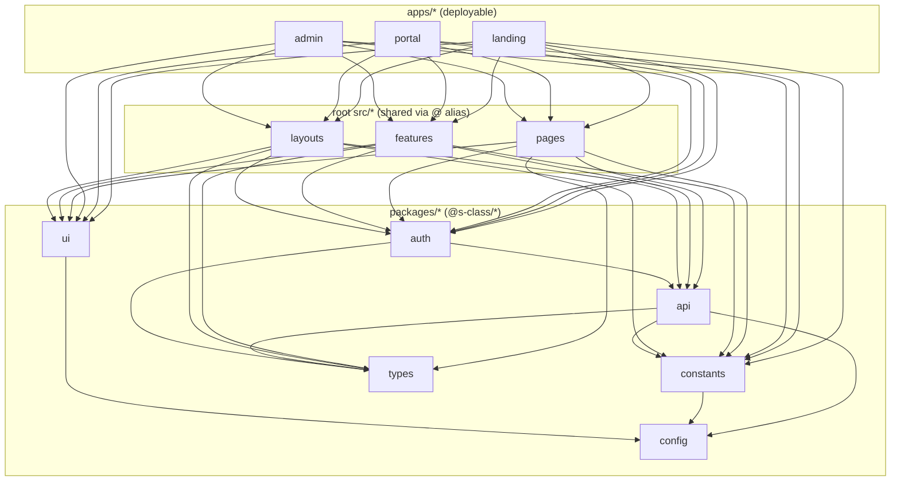

# 3. Repository Structure

This repo is an **npm-workspaces monorepo** mid-migration from a single SPA into
separate app shells plus shared packages. Student-facing production routes share
the apex origin; admin remains on its own subdomain.

## Top-level map

```text
elearning-review-platform/
├── apps/                  # Runnable Vite workspaces
│   ├── landing/           #   marketing + auth + /portal    → s-class.com.ph
│   ├── portal/            #   portal source + isolated local testing
│   └── admin/             #   admin console                 → admin.s-class.com.ph
├── packages/              # Shared workspace libraries (@s-class/*), source-only
│   ├── api/               #   data layer: clients, provider routers, services, mocks
│   ├── auth/              #   Zustand stores + route guards
│   ├── config/            #   the only reader of import.meta.env
│   ├── constants/         #   route strings + cross-origin URL helpers
│   ├── types/             #   shared domain TypeScript types
│   └── ui/                #   primitive UI components + cn()
├── src/                   # Shared SOURCE LIBRARY (NOT a runnable app) — used via @ alias
│   ├── components/        #   shared app components + ui/ primitives (legacy copies)
│   ├── constants/         #   routes.ts (re-export), upload.ts
│   ├── features/          #   feature-colocated components/hooks/services/types
│   ├── hooks/             #   content-protection + debounce hooks
│   ├── layouts/           #   PortalLayout + portalNav
│   ├── lib/               #   toast helper
│   ├── pages/             #   cross-app pages: LessonPage, SubjectDetailPage, SubscriptionPage
│   ├── services/          #   thin re-export shims → @s-class/api (compat layer)
│   ├── store/             #   re-export shims → @s-class/auth + quizStore.ts
│   └── utils/             #   cn.ts, money.ts
├── functions/             # Root copy of Cloudflare Pages Functions (R2 asset proxy)
├── public/                # Root static assets (logo, etc.) — apps point publicDir here
├── supabase/              # Backend: schema.sql, migrations/, functions/, seed/, config.toml
├── dist/                  # Stale build output of the pre-split app (git-ignored content)
├── ARCHITECTURE.md        # Current-ish architecture overview (2026-06-09)
├── DOCUMENTATION.md       # Exhaustive but partly STALE reference (April 2026)
├── CLAUDE.md              # Implementation notes for AI agents (partly stale on commands)
├── CLOUDFLARE_PAGES.md    # Per-app Pages deployment checklist
├── README.md              # Project entry point — overview + links into docs/
├── components.json        # shadcn config
├── eslint.config.js       # flat ESLint config
├── tsconfig*.json         # project-reference TS config
└── package.json           # workspaces + dev/build/lint scripts
```

> **The single biggest gotcha:** there is **no `src/app/router.tsx`,
> `src/main.tsx`, or root `index.html`**. The root `src/` is a *library*, not an
> app. `ARCHITECTURE.md` and `CLAUDE.md` still mention a "legacy root app on
> 5173" — that is stale. The runnable entry points are `apps/*/src/main.tsx`.

## Architectural boundaries



**Dependency direction (allowed):** `apps → src → packages`, and within packages
`api/auth/ui/constants → config/types`. Nothing in `packages/*` imports from
`apps/*` or root `src/*`. See [system-map.md](system-map.md) for the detailed
coupling analysis.

## `apps/` — ownership

Each app is a thin Vite shell: `main.tsx` boots `authStore.initialize()` then
renders the app's `RouterProvider`. Pages either live in the app or are imported
from shared `src/pages` via `@`.

### `apps/landing` (public marketing + preview)
```text
apps/landing/src/
├── app/router.tsx              # public routes + /login + /portal/*
├── layouts/{RootLayout,Navbar}.tsx
├── pages/                      # HomePage, About, Contact, FAQ, Books, BookDetail
├── features/home/              # hero, testimonials (marketing blocks)
├── components/RedirectToPortal.tsx
└── constants/                  # aboutCopy, contactInfo, faq, offerings, testimonials
apps/landing/functions/         # Pages Functions copy (thumbnails/avatars/quizzes/covers + _lib)
```
Owns: `/`, `/about`, `/contact`, `/faq`, `/books`, `/book/:id`, `/pricing`,
`/preview/subject/:id`, `/preview/lesson/:id`, `/login`, `/register`,
`/forgot-password`, `/reset-password`, and `/portal/*`. Reuses
`SubscriptionPage`, `SubjectDetailPage`, `LessonPage` from `src/pages`.

### `apps/portal` (student portal parity)
```text
apps/portal/src/
├── app/router.tsx              # learning-only routes; guards + bouncers
├── layouts/PortalRootLayout.tsx
├── components/                 # PortalProtectedRoute, PortalGuestRoute,
│                               #   PortalAdminBouncer, PreviewBouncer
└── pages/                      # Login, Register, Forgot/ResetPassword, Dashboard,
                                #   Subjects, PortalSubject(s)/Hub, QuizHistory,
                                #   Profile, Devices, BookCheckout, Payment{Success,Cancel}
```
Mirrors auth flows + authenticated learning + book checkout + PayMongo callbacks
for isolated local development. Landing imports these pages/components and serves
normal student production access under `s-class.com.ph/portal`.

### `apps/admin` (role-gated console)
```text
apps/admin/src/
├── app/router.tsx              # /login + guarded /admin/* (lazy-loaded pages)
├── components/                 # AdminProtectedRoute, AdminGuestRoute
├── features/
│   ├── admin/components/       # AdminLayout, AdminTable, StatCard + 7 modals
│   └── courses/types.ts
└── pages/                      # AdminLoginPage + admin/Admin*Page (12 pages)
```
Owns `/login` (same-origin admin session) + `/admin/*` CRUD. Non-admins are
bounced cross-domain to portal.

## `packages/` — ownership

| Package | Key files | Notes |
|---|---|---|
| `@s-class/api` | `*Api.ts` (routers), `*.service.ts` (Supabase), `apiClient.ts`, `supabaseClient.ts`, `admin.service.ts` (1266 lines), `data/*` (mocks) | Browser-safe data layer. Subpath exports per module. |
| `@s-class/auth` | `authStore.ts`, `savedSubjectsStore.ts`, `quizHistoryStore.ts`, `components/*Route.tsx`, `DeviceLimitModal.tsx` | Stores + guards. Peer-deps React/Router. |
| `@s-class/config` | `index.ts` | `config` object; `detectAppEnv()`. |
| `@s-class/constants` | `routes.ts`, `urls.ts` | `ROUTES`, `EXTERNAL`, `getRouteOwner`, `getAbsoluteUrl`. |
| `@s-class/types` | `auth/books/courses/subjects/devices/home/lessons/quiz/subscription.ts` | One file per domain; barrel `index.ts`. |
| `@s-class/ui` | `cn.ts`, `components/{button,input,badge,skeleton,ErrorMessage,PageLoader}.tsx` | Primitives. |

Packages are **source-only** (no build step) — `main`/`types` point straight at
`./src/*.ts`; Vite/TS consume them directly.

## `src/` — the shared library (detail)

| Subfolder | Contents | Status |
|---|---|---|
| `pages/` | `LessonPage` (889 lines), `SubjectDetailPage` (313), `SubscriptionPage` (294), `LessonPageSkeleton` | Cross-app pages — actively shared. |
| `features/` | `lessons/`, `quiz/`, `subjects/`, `subscription/`, `books/` — colocated components/hooks/services/types | Real implementation lives here. |
| `layouts/` | `PortalLayout` (372), `portalNav.ts` | Portal sidebar shell. |
| `components/` | shared (`MathText`, `ContentWatermark`, `SiteBackground`, `SubjectThumbnail`, `CanonicalLink`, `LogoutModal`) + `ui/` primitives | `ui/` here duplicates `@s-class/ui` (legacy copies). |
| `services/` | `*Api.ts` files that are **3-line re-export shims** → `@s-class/api` | Compatibility layer; safe to import either. |
| `store/` | `authStore.ts`/`quizHistoryStore.ts`/`savedCoursesStore.ts` = re-export shims; `quizStore.ts` = real (active-quiz state) | Mixed. |
| `config.ts` | 5-line re-export of `@s-class/config` | Shim. |
| `constants/routes.ts` | re-export of `@s-class/constants/routes` | Shim. |

> The `services/` and `store/` shims exist so legacy `@/services/...` imports keep
> working after the real code moved to `packages/`. New code should import the
> `@s-class/*` package directly. See [technical-debt.md](technical-debt.md).

## `supabase/` — backend

```text
supabase/
├── schema.sql                  # initial schema (6 tables, view, RLS) — baseline only
├── migrations/                 # 30 SQL files; mix of timestamped + un-timestamped
├── functions/                  # 11 Deno Edge Functions (one dir each, index.ts)
├── seed/create_admin.sql       # how to grant the admin role
└── config.toml                 # project id + per-function verify_jwt settings
```

See [database/database-overview.md](database/database-overview.md) for the schema
and [backend-architecture.md](backend-architecture.md) for the functions.

## `functions/` (root) and `apps/*/functions/`

The Cloudflare Pages Functions that proxy public R2 assets are **duplicated**: a
root `functions/` copy and app-local `functions/` copies. The Landing and Admin
Pages projects deploy their colocated copies; Portal's copy remains for isolated
local/manual parity. Consolidating to a single `cdn.s-class.com.ph` is a tracked
future cleanup (`CLOUDFLARE_PAGES.md`, "Deferred items").
