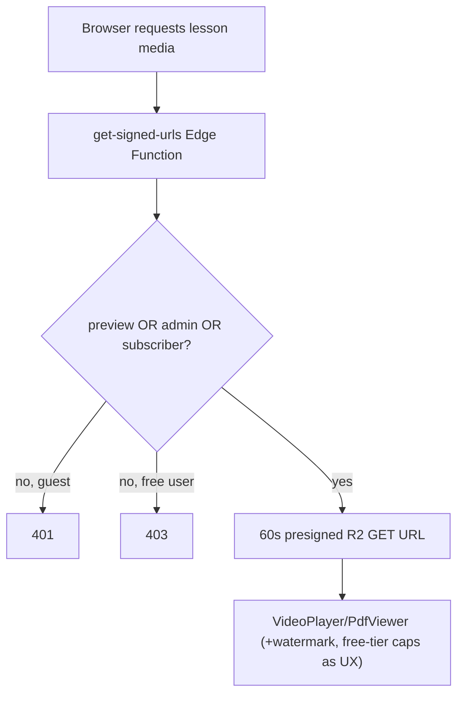

# 9. Security

> **Mental model:** the browser is untrusted. React route guards, tier checks,
> and content-protection hooks are **UX deterrents**. The actual security
> boundary is **Postgres RLS + Edge Functions + signed URLs**. Every claim below
> is anchored to that principle.

## Authentication
- **Supabase Auth**, email/password, JWT sessions in `localStorage` **per origin**.
- All student auth happens on **`portal.*`** (landing redirects auth routes there)
  so the session lands on the origin that uses it. Admin has its own same-origin
  `/login`. This avoids "logged in on landing, invisible to portal".
- **Session bootstrap** (`authStore.initialize`) restores the session before route
  guards run (prevents flash-redirect; also prevents a guard from acting on a
  half-known auth state).
- **Email confirmation** can gate first login; **password reset** flow exists
  (`resetPasswordForEmail` + `PASSWORD_RECOVERY`).

## Authorization
- **Admin** = `auth.users.app_metadata.role = 'admin'`, **server-set only**
  (SQL/dashboard). The client SDK cannot modify `app_metadata`, so the role cannot
  be self-granted. Enforced by `is_admin()` in RLS and re-checked in Edge
  Functions (e.g. `get-signed-urls` reads `app_metadata.role`).
- **Subscriber** = active, non-expired `subscriptions` row (`is_active_subscriber`).
- **Free-preview** = per-lesson `is_free_preview` (the only premium carve-out that
  works for anonymous guests).

## Role/permission summary
| Actor | Can read | Can write |
|---|---|---|
| Anon guest | published subjects, `lesson_previews`, public CMS views, preview quizzes, preview media (via Edge fn) | nothing |
| Authenticated (free) | + own profile/subscription/results/progress/devices/orders/payments | own saved subjects, lesson progress, quiz results (preview only), profile |
| Subscriber | + premium lessons, all quizzes, premium media | + quiz results on any lesson |
| Admin | everything (admin RLS) | full CRUD on content/books/CMS; manage users/orders |

## RLS — the real boundary
RLS is enabled on every user/premium table; policies use SECURITY DEFINER helpers
(`is_admin`, `is_active_subscriber`) with `search_path = public` hardening. The
strongest tier is **service-role-only writes** (no client policy) for `payments`,
`book_orders` INSERT, and `user_devices`. Full matrix:
[database/rls-policies.md](database/rls-policies.md).

## Content protection (premium media)

| Layer | Mechanism | Strength |
|---|---|---|
| Signed URL (60 s TTL) | R2 + Edge Function | **Strong** — short-lived, per-session |
| Subscription/preview check | server-side in Edge Function | **Strong** — authoritative |
| RLS on lessons/quizzes | Postgres | **Strong** — DB-level |
| `lesson_previews` redaction | view excludes premium columns | **Strong** — premium URLs never client-readable |
| Watermark overlay (`ContentWatermark`) | client | Medium — visual deterrent |
| DevTools shortcut block (`useContentProtection`) | client | Weak — shortcuts only |
| Screen-record heuristic (`useScreenRecordingDetection`) | client | Weak — detection, no prevention |

Premium R2 keys are **never** in an allow-listed public-proxy prefix
(`thumbnails/ avatars/ quizzes/ covers/`), so they cannot leak through the Pages
asset proxy.

## Payments
- **Idempotent + ownership-checked.** `verify-payment` confirms
  `metadata.user_id == auth.uid`, checks PayMongo paid status, and upserts
  `payments` on unique `paymongo_id`. Webhook is a server-to-server backstop with
  signature verification (`PAYMONGO_WEBHOOK_SECRET`).
- **No client can forge "paid":** `payments` and `book_orders` INSERT have no
  client RLS policy; only service-role Edge Functions write them.
- **Server-authoritative pricing:** the charge amount is the server constant in
  `create-checkout`/`verify-payment`, not a client-supplied value.

## Sensitive-data handling
- **Secrets** live only in Supabase secrets / Cloudflare bindings; the build guards
  against `VITE_`-prefixing them. The anon key is public by design (RLS protects data).
- **PII** (name, email, mobile, school) is in `profiles`, RLS-scoped to the owner +
  admins.
- **R2 credentials / PayMongo keys** exist only in Edge Functions.

## Potential security risks (ranked)

| # | Risk | Severity | Detail / fix |
|---|---|---|---|
| 1 | **`subscriptions` insert/update-own RLS** | High | Legacy `schema.sql` policies let a user write their own subscription row in principle → free premium. **Fix:** drop client write policies; rely on service-role `extend_subscription`. |
| 2 | **Quiz scores are client-computed** | Low-Med | `quiz_results.score/total` come from the browser; RLS checks who/where, not the value. Fine for self-study, not for graded use. **Fix:** score server-side if scores ever matter. |
| 3 | **CORS `Access-Control-Allow-Origin: *` on Edge Functions** | Medium | All functions allow any origin. Mitigated by JWT/ownership checks, but tightening to the three known origins reduces abuse surface. |
| 4 | **Single shared Supabase project + R2 bucket across envs** | Medium | Branch previews run on production data; a bad migration or test write hits prod. **Fix:** separate staging project. |
| 5 | **`get-signed-urls` has `verify_jwt = false`** | Low (by design) | Required for guest previews; the function re-authenticates and authorizes in code. Documented in `config.toml`. Do not copy this flag to other functions. |
| 6 | **`lesson_previews` `security_invoker = false`** | Low (by design) | Re-triggers the Supabase advisor "Security Definer View" warning; accepted because the SELECT list excludes premium columns. Keep premium columns out of it. |
| 7 | **No rate limiting / brute-force protection** beyond Supabase defaults | Low-Med | Login + Edge Functions rely on Supabase/Cloudflare defaults; no app-level throttling. |
| 8 | **Schema drift (`quiz_questions`, `thumbnail_url`)** | Low (security-adjacent) | Out-of-band objects aren't in migrations; RLS for them *is* in migrations, but a rebuilt DB could miss the table or its policies. |

## Recommended improvements
1. **Lock down `subscriptions` writes** to service-role-only (highest priority).
2. **Restrict Edge Function CORS** to the three known production origins (+ preview).
3. **Stand up a separate staging Supabase project** so previews don't touch prod data.
4. **Add app-level rate limiting** on auth + checkout (e.g. Cloudflare Turnstile/WAF).
5. **Capture a canonical schema dump** to eliminate drift and make RLS auditable.
6. **Add a security regression test**: "an unsubscribed user calling the Edge
   Function / DB directly is blocked" — the test that actually matters here.

See [recommendations.md](recommendations.md) for the consolidated, ranked backlog.
