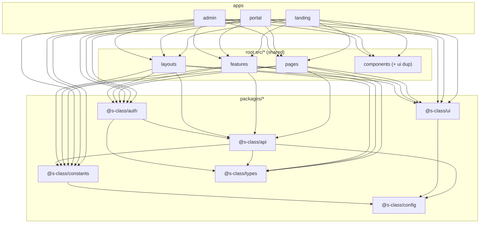
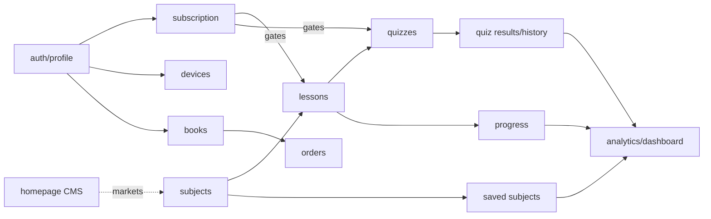
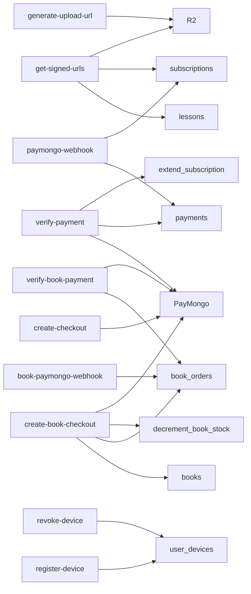

# 16. System Dependency & Architecture Map

Cross-cutting maps of how the system fits together: modules, features, database,
routes, and RPCs — plus coupling/risk analysis.

## Module dependency graph



**Rule:** edges only point downward (`apps → src → packages`; within packages
`→ config/types`). No package imports `apps/*` or root `src/*`. Verified from the
import surface of `packages/*/package.json` (deps only reference other `@s-class/*`).

## Feature dependency graph



## Database dependency graph

```mermaid
flowchart TD
  users["auth.users"]
  users --> profiles & subscriptions & saved_subjects & lesson_progress
  users --> quiz_results & payments & book_orders & user_devices
  courses --> subjects --> lessons --> quizzes --> quiz_questions
  subjects --> saved_subjects
  lessons --> quiz_results
  books --> book_orders
  subscriptions -.->|is_active_subscriber()| lessons
  subscriptions -.->|is_active_subscriber()| quizzes
```
Dashed = logical (RLS function) dependency, not an FK. Full FK list:
[database/relationships.md](database/relationships.md).

## Route map (by owning subdomain)

| Owner | Path | Page | Guard |
|---|---|---|---|
| landing | `/` | HomePage | — |
| landing | `/about` `/contact` `/faq` | static pages | — |
| landing | `/books` `/book/:id` | storefront (browse) | — |
| landing | `/pricing` | SubscriptionPage (marketing) | — |
| landing | `/preview/subject/:id` | SubjectDetailPage (preview) | — |
| landing | `/preview/lesson/:id` | LessonPage (preview) | — |
| landing | `/login` `/register` `/forgot` `/reset` | → redirect to portal | — |
| portal | `/login` `/register` `/forgot-password` | auth pages | GuestRoute |
| portal | `/reset-password` | ResetPasswordPage | (no guest guard — recovery session) |
| portal | `/` | → `/dashboard` | Protected |
| portal | `/dashboard` `/quizzes` `/subscription` `/profile` `/profile/devices` | portal shell pages | Protected |
| portal | `/portal/subjects` `/portal/subjects/:id` | subject hub | Protected |
| portal | `/courses` `/course/:id` `/lesson/:id` | learning (Subjects/lessons) | PreviewBouncer → Protected |
| portal | `/book/:id/checkout` | checkout | Protected |
| portal | `/payment-success` `/payment-cancel` | PayMongo callbacks | public |
| admin | `/login` | AdminLoginPage | AdminGuestRoute |
| admin | `/admin` | dashboard | AdminProtectedRoute |
| admin | `/admin/courses` | **AdminSubjectsPage** (manages Subjects) | AdminProtected |
| admin | `/admin/categories` | **AdminCoursesPage** (manages Courses) | AdminProtected |
| admin | `/admin/{lessons,quizzes,users,subscriptions,books,orders,announcements,welcome-videos}` | respective pages | AdminProtected |

> Mind the two legacy swaps: `/admin/courses`→Subjects, `/admin/categories`→Courses.

## RPC usage map
See [database/rpcs.md](database/rpcs.md). Summary:
- Browser → `get_dashboard_stats`, `get_saved_subjects_progress`, `get_quiz_history`.
- Edge → `extend_subscription`, `decrement_book_stock`, `restock_book`.

## Edge Function ↔ table/service map



## Component dependency hotspots
The most-depended-on / highest-fan-in modules (changing these ripples widely):

| Hotspot | Why it's central |
|---|---|
| `@s-class/auth/authStore` | every app boots it; orchestrates subscription/devices/saved/quiz stores |
| `@s-class/config` | sole env reader; imported transitively by everything |
| `@s-class/constants` (routes + urls) | every navigation + cross-subdomain link |
| `@s-class/api` (`supabaseClient`, facades) | all data access |
| `src/pages/LessonPage` | shared by landing (preview) + portal; 889 lines |
| `packages/api/src/admin.service.ts` | single entry for all admin writes; 1266 lines |
| `get-signed-urls` Edge Function | the premium gate for all media |

## Highly coupled modules / bottlenecks
- **`src/*` shared via `@` alias** couples all three apps to one mutable source
  tree during the migration (a change to `LessonPage` hits landing + portal).
- **`admin.service.ts`** is a god-service bottleneck for admin writes.
- **`authStore`** is a single orchestration point — powerful but central; bugs
  here affect login across all apps.

## Circular dependencies
None observed at the package level (the dependency graph is a DAG:
`api↔auth` is one-directional `auth → api`; `config`/`types` are leaves). Within
the auth store there is an intentional runtime fan-out to sibling stores
(`savedSubjectsStore`, `quizHistoryStore`) — a coordination dependency, not a
cyclic import. **Recommendation:** keep packages acyclic; if `auth` ever needs to
import from a feature, invert with a callback/registration instead.

## Risk areas (map view)
| Area | Risk | See |
|---|---|---|
| Shared `src/*` alias | wide blast radius during migration | [technical-debt.md](technical-debt.md) |
| `subscriptions` RLS | client-writable | [security.md](security.md) |
| Schema drift | non-reproducible DB | [database/tables.md](database/tables.md) |
| Single Supabase/R2 across envs | prod data in previews | [environments.md](environments.md) |
| God files | review/test difficulty | [technical-debt.md](technical-debt.md) |
